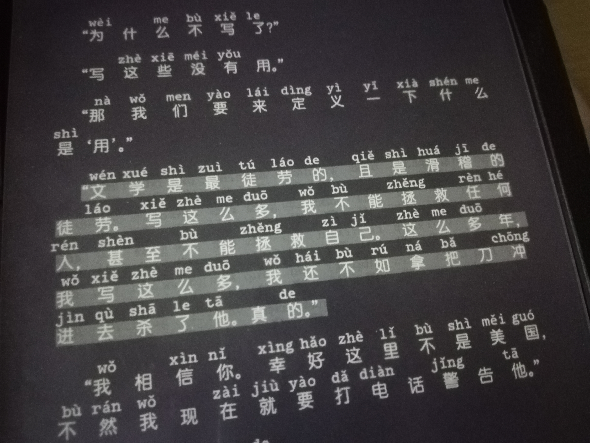

# 2018年全年所作文

## 大一上学期的总结

时间过得真快，2017年9月开学，转眼间,就到了2018年1月,再过半个月就期末考试，然后就是春节，意味着大一只剩下半年了。我对这六个月来，真正弄明白了的是:我从未了解过自己。大学的日子过得有些混账，心想要是我父亲在我身边多好呀，严厉的父亲，不必言太多，便能够教会我很多在我这个年龄该做什么事等道理，每次想到父亲，我还是一如既往地满脸苦涩，他本人倒是非常开明，性格也开朗，遇到真正的困难时，他不曾废话太多，但他的行为总是能把父亲的深刻含义解释得淋漓尽致，使我不得不对父亲怀有敬畏和感激之心。许多大学生，拿着父母打来的钱，可以在远离家乡的另一个地方活得很潇洒，过得很体面，根本不用考虑太多如何保障未来生活吃穿等问题，但父母的生活方式始终得不到真正的进步，其原因是挣钱的方式没有进步，所以，大部分人的父母挣的仍是辛苦钱。整个读大学期间，我都不该忘记这一事实。另外，不知道有没有那种人，就是自己的父母是偏文盲的，这部分人在来到大学后，以为自己接受了新潮流的洗礼，便跟上了时代的步伐，在回到家与父母交流的时候，便在他们面前表现自己，父母一主动谈起话来，就赶快想办法让父母闭嘴，认为父母的那一套话过时了，对接受过高等教育洗礼的人来说，不管用，而且那套话古板，枯燥无味，几乎是老生常谈，令这些祖国的花朵反感至极。这又是一个需要记住的事实。

罗马不是一天建成的，需要过程，需要时间。

Something will happen,time will tell.

-于2018.01.01

## 一点胡想

在我孤独地度过一段时间后，总会有体会，自我封闭带给我强烈的感受，所有文字全都发自内心，自然渴望得到展露，且于现实无法落实的想法只能写下来，至少它曾在脑海闪过，值得我记下它的名字，记叙想法的想法使我变得异常冲动，即使夜深人静，舍友已悄然入睡，打着呼噜，我也愿意在这样一个时间段里记下它的名字，一点都不想拖延，绝不能妥协。我自己发现了这样一个事实:只要我离开人群一段时间，而个人周遭环境不太嘈杂，即方便脑子做些思考，那在这种情况的的我，特别容易胡思乱想，甚至，离开得越久，我且想得越多。如今呀，我倒是好生羡慕离开人群的那些日子，它们充满了无聊，沉闷，痛苦，也正是那样才塑造了我。今后，若想再尝尝胡思乱想的味道，还得继续离开人群，忍耐那我本该放弃的痛苦。

-于2018.01.01

## 我的颓废

1.说真的，我不知道，我实在不知道像昨天那样窝囊地在宿舍的床上躺上一整天的情况在接下来的四年里会重演多少遍，用“一日无书，百事荒芜”来作为在大学里的生活是上进还是颓废的判断标准，那我一定浪费掉了很多时间和精力，全被昨天的我用来“躺”在宿舍了。我对昨日之行为深恶痛绝，真的好生厌恶。

2.我不是什么主人公，也不是什么…只是一个平凡的满大街都能看见的大学生…但如果以我为主角写一部作品的话，那一定，是一个悲剧…

-于2018.01.01

## 酷酷的存在

回想在大一军训过程中，我所在的这支队伍，有一位女生，长得高高的，瘦瘦的，每次同这支队伍前行都走得很好看，教官对她说:"你走路酷酷的，你走路真的很好看，酷酷的，平时这样走真的很酷，但不符合这支队伍前行的要求。"说完，教官让她修正自己，再来回走几次，不过还是老样子，于是教官说:"你归队吧，还是就按照你自己原来的姿势走。" 她的“特立独行”，其本身就是一种美感，我想教官也不忍心再修改。 有部分人为什么，不需要说任何话，不需要做任何事情，只需要静静地发呆，就能给看过ta的人带来好心情？上天对ta们进行设计，让ta们“酷酷的”存在，我想是为了给人带来希望，带来美好，渲染更多的人“酷酷的”活着！

-于2018.01.01

## 情呀爱呀

一日无书，百事荒芜。

真是这样，懒惰的人儿啊，迟早会吞下由懒惰带来的恶果。如果我对自己真的抱有希望，就不应该被什么情啊爱啊牵扯太多，我越来越觉得，我的一生，包括我在乎的人的一生，不该太平庸，至少，人活着，应该做点建设性工作吧，不要循规蹈矩，像木头人，当然，做木头人也有做木头人的好处，但人活着总该有些追求吧，有时遇到什么鸡毛掸子的小事，就不要老想着它了，想与不想的结果都不会改变太多，反而还为自己的正常生活添堵。年纪轻轻，总是一遇到喜欢的人，然后就为情所困，走不出那个二人的世界。有趣的灵魂，可不是每个人都有，但，读书至少可以使人变得博学，拓宽自己的视野，不至于一遇到什么情啊爱呀，就在一颗树上吊着，不愿下树。我对自己的建议呢？呵呵，人本来就是情感动物，寂寞起来人人都一样，心里容易多想出很多事情，总觉得不舒服，感觉自己走到了尽头，一切都完了。但是，不是所有人都符合这个模式，我就希望自己特别一点，不要去走这个俗人使用的模式，心动了心烦了，就赶紧找点事做，最好是看书，看自己想看的书，一点都不要拖延，只要拖了，几乎就不会再去做了。比起真实生活里的情爱，我觉得书中的情爱更有趣，更细腻，更得我意。主要还是因为，这样做不伤自己的身体，书一闭，爱恨情仇全都可以抛却，因为它是作者虚构出来的，那些人物事件全都跟我生活没有实际的瓜葛，不管作者笔下的那个男人多么的俊，多么的富有，但又多么地狼心狗肺，我都不会嫉妒或者气愤太久，至少它不会过分影响我在现实生活中的心情。总结一下，我其实是希望自己呢，不论是平常时间，还是那个遭遇什么爱呀情呀的特殊时候，都不要忘了看书这件事。说得倒是畅快，可是要好好地行动起来，其难度可不再是像这句话这么简单了。前面突然谈到有趣的灵魂，是呀，谁不希望一切事和人都尽善尽美，我呢，觉得读书是使一个人变得有趣的有效途径，另外，我并不觉得我这个人有趣，有趣而不学习的人，终究会变得老套而无味，所以才强调选择看书。对于生活中的爱啊情呀这些玩意儿，我可是实实在在的外行人，不过我也有些想法，一个人在人生路上前行时，走着走着，突然多了一个人和自己一起走，这很好，多一个人陪伴就多一些关于爱的美好感受，但走到人生的十字路口时，不要忘了自己的出行目的，这时候需要选择走哪条路，因为多了一个人，他也有他的人生路要走。两个人的目的如果不相同，就需要舍弃，在我看来，只有两个关于舍弃的解决办法，一是舍弃掉自己的出行目的，去将就和支持这个自己要交付终身的人，陪他走完他的那一条人生路，二是舍弃掉这个人，舍弃掉他的陪伴，理清思绪，将那份关于两个人的美好回忆，藏在心底，继续独行，在自己的这条人生路上，好好走下去便是。也有一个例外，那就是这两个人的出行目都一样或相似，且都做得到‘‘执子之手，与子偕老’’，但这种情况真的不敢奢求遇到，尤其是像我这样读书太少，又想得太多的人。以上的说法对实际情况而言不仅不完全而且十分粗糙，姑且视作我个人的胡思乱想好了，这算是个人的局限性的表现吧。

另外，现在的情啊爱呀确实很容易使深处其中的人成为名符其实的废人。而如果深处其中的人还不忘独善其身，比如坚持看书，坚持不断地更新自己技能，那真的会减少许多二人间的矛盾。我真是佩服这样的人，有一个雷都打不动的优秀习惯，对我而言，我希望那个习惯是看书，即使现在没有完全养成这个习惯，今后也要做到。

-于2018.01.05图书馆自习室记

## 关于复读的想法

现在我开始着急了。

我有一个大胆想法：回到生源地继续参加高考，让我爸再养我半年。但态度不是很坚定，一是二次高考不一定能考出高分，对学校的选择也不明确，心里并没有很明确的目标，目标订得再高，最后还是分数说话，二是心里素质差，担心自己明明上了大学，然后又跑回去继续念高中，很不争气，很没出息，周围人总是要说很多闲话，担心我爸他沉不住这些气。

其实，我打心底还是想再读一次高三，梦想着：这一次，我一定要手持血红色彩的屠龙，一直杀到最后。

来到大学，转眼间大一上半年就快结束了，本月15号就考试。简单地讲述一下我的学习历程。我尽量写得悲壮一点，尽管我还年轻。

读小学的时候，我成绩非常差，当时还不懂事（即使是现在也没有真正懂事），一心只晓得玩，小学六年级下学期期末考试过后，成绩出来了，我考了164分，当时去了一所非常破烂的学校报名，我上午自己一个人去报的名，踏进那个不像校门的校门，边走边打量周遭的环境，心里面真的很不是滋味，当时吃饭听说不是用磁卡，也不用现金，而是用学校发的粮票。幸好我的伯父是开书店的，认识很多老师，他帮忙打听了一下其他学校还有无未招满的名额。所以在下午我就转学去了另一个学校——那个学校是伯父他曾经就读的中学，所以他比较放心。这可能是因为小学的我真的是太混账了吧，让家里的很多亲戚觉得这个小孩太顽皮了，不像学生，不知道用功读书。可能最主要的还是穷，养成了许多坏习惯。怎么个穷法？就是那种爸爸不给我钱花，我从来就没有过零花钱。记得有一次，爸他在给几个工人结账时说：那二十块钱就算了，不用给了。我当时听完下巴都快要掉地上了。什么？二十块钱！居然算了！我在想：爸他为什么不把钱花在我身上啊。二十块钱，对于一个08年还在读小学的我来说，已经很多了，那时我一天才几块钱，注意，这不是零花钱，只是生活费。在我读高三之前，根本就不知道零花钱和生活费的真正区别，在那之前一直是把身上可以用的钱称之为零花钱，因为这样做比较酷，这样做就可以显得自己有钱。真是幼稚。更具讽刺意义的是，上午我去报名的那个学校，在当天下午就说不办学了。真是不拍而合！辛亏我走得早，走得有目标，不然不知道会被分到哪个地方去延续我小学的那些混账做法。

读初中，进入了1班。（全年级一共有10班,1-5班是实验班，6-10班是普通班，全年级最优秀的是5班，其次是2班，最后是3班和1班，之所以这里要这样说，是因为我到了高中之后，就深深地体会到了实验班和普通班的一些差别：管理制度，学习氛围，人生理想，对待生活的态度，日常交流的话题）在我读初一时，数学最差，也因此在后来被强迫叫去找班补课，然并卵，对于补课这件事，对我最大的感受就是：这世界太大了，在那个地点那个时间，虽然你们坐在了同一间教室，而补完课，人家就跑去街上各种嗨，叫上朋友体验各种世间繁华，有的人就只有背着小书兜，回到家里老老实实地待在那自己狭隘的小世界，比如我。初一的时候每周都会和同学发生冲突，不服气就打呗，打不赢就找老师道歉呗。记得当时最频繁的是在一星期里和同班同学发生了三次冲突，每次都用上了手脚，然后我被通知了家长，我爸那段时间还很气愤递给我说：你再这样就不用去念书了。哎。年少无知啊！不过，在初二下学期的时候，我选择了一个好的榜样，他就是我同桌-——侯明华。当时他也就经常考班级第一，是个很中规中矩的人，人很老实，理性思维很强，当时加上补课，知道了自己与县城里的孩子有一些差距需要去填补，然后就埋头苦干吧。我经常把初二下学期的那段时间比作我中学时代的“十一届三中全会“，真是一个刻骨铭心的重要转折点！从初二下开始，我就每天都学啊学，晚上倒头就睡，因为不怎么用手机，学校查的严，我也懒得去“偷渡”。初三那一年可以说是过得极快，非常充实，非常踏实，在一个人的时候不会像高中那样胡思乱想太多，不会埋怨周遭环境仍是多么地不如意，尽管我很有野心，感觉自己很牛逼，很特别，和周围那些凡夫俗子是不一样的，但我从来不表现出来，甚至时常加入到他们中间去，希望人群能同化掉我的自大和浅薄，并以此期望获得凡夫俗子的乐趣。我的自大主要还是来自瞧不起那些家里本来就不富还不好好念书的人，他们的原则大致是‘’人生苦短，及时享乐‘’，相比于我那时的野心，很自然我会感到自大，那是什么样的野心？这个就很抱歉了，我没有记录下来哎。尽管我在心里很自大，但我从未说出来过。我也没有使用自己的这种自大去伤害任何人。一个在学习上真正丰收了许多的人，是不会有那些闲情雅志去搭理与自己主业相比较而显得无关紧要的事的。现在的我觉得初三的我就做到了这一点。很自然地，同许多考生情况一样，我考上了县城里的重点中学。

对于高中，首先还是得说说这个学校，它的教学设备应该是全县普高重点中学中排名第二了，（这里的教学设备仅仅指高中教室里的基础设施，为什么这么说，因为除了这个几乎就没什么值得庆幸的了，当然这只是我的个人观点），是很适合读书的，毕竟教室不差。然后老师人都还行，也有几个印象很深的老师，都不谈了，有好，也有坏。高中老师，大致就那样吧。毕竟高中生一个个的看起来跟成年人没什么区别了，老师很少再像初中老师那样一根筋咬着你“走正路”，因此，许多人不好好学，老师也不会像讨债鬼一样追着你学习。高中学习，主要是靠自觉。全靠自觉，对我而言是不可能的，班级的学习氛围非常重要。毕竟人心不是铁打的，自己的家庭又没有经历什么生死离别或伤残等重大事故，所以对于一般人哪有那种钢铁般的毅志，并且要持续三年，最起码也要持续一年（熬过高三）才行，不然很容易被劣质的学习氛围带偏，或者就像我一样，意志力不强，还常常胡思乱想，想跳学校，平白无故地想出很多关于乱七八糟的东西，结果是不了了之。不消说，我就读的是该学校的普通班，当时只差0.1分就可以进实验班，但0.1分也是分，我就这样被学校毫不留情地划进了普通班。现在回看高中，自己那时过得挺糊涂的。高一，我更像是一个励志大师，傻头傻脑的书呆子，只知道读书，然后发呆，感悟一些没经历过的屁事儿。高二、高三大致也是这样的状态吧。 在学习上，我不是很好，年级500左右的理科生，我只能排到70~120这个名次，在班上的排名就很靠前了，不过根本就没什么用，只能说是看着舒服，但也得承认，只有班排名靠前了，才好有勇气去看年级排名，尤其是针对普通班的学生。就写这么多了吧。我的高中很普通，很多经历就是这样，明明在当时是有许多牢骚是要发的，但在还没有翻过那些坎之前不能全都说出来，当翻过了这些坎，反而更喜欢沉默起来。就像2017年6月8号的那个黄昏，同学们陆陆续续地从考场静悄悄地走了出来，少有人这样呼喊着：终于解放啦！！！解放啦！！更多的人，心里其实是很有感受的，但他们就静静地走埋头走路，把那份最真的体会深藏于心。

我的几个遗憾：

1.在小学升初中的时候，伯父没有联系县里的重点中学，而他的母校相当偏僻——位于离县城有十几公里的小镇里。我想他可能觉得我很容易学坏，城市确实繁华颇多，诱惑挺多的，仔细想来也有这个可能。还有一个原因可能是麻烦，去了可能也跟不上课程进度，现在重新想一下，要是当时爸他能为我争取一下留在县城的重点中学读书，那该多好呀！我并不是完全不懂得珍惜父母和亲人为我的付出。

2.在初中升高中的时候，我没有认真去比较县上的那两所重点中学，当时其实我已经很高兴了，我爸他也很满足，可能觉得终于考上了重点中学，很不容易什么的。然后很匆忙地在根本就没真正了解学校的情况下就填了志愿。我填的是A校，当时的分数可以在A、B两个学校中选择，而就读了一段时间才发现B校的教学资源要相对优秀许多。但错过了就是错过了，选择了就是选择了。有时人生真像一道选择题。

3.在高二上学期刚开学的时候，我很想转学校。当时我的想法很简单：人生只有一次，我要去县里最好的中学去念书，把中学时代剩下的最后两年时光花在这个“县里最好的中学“身上，那样的话我对中学时代就没有任何遗憾了。高二上是我胡思乱想最频繁的时期。当时给父亲提了这个想法，很不幸，他没有说yes。原因很简单：我就读的中学已经是重点中学了，这就足够了，没有必要再去折腾转校的事。父亲当然是这样说，最根本的其实是钱的事。转校意味着花钱，还要去找关系请吃饭。而当时父亲已经在家里待了近一年了，虽然期间也有在外面东奔西跑，但始终没有去找工作。在这种情况下，对他来说，能不花的钱尽量不花，能省的尽量省，再加上，正如之前说的，父亲对我而言没有太高的期望，他认为我靠自己努力能上重点中学，这就足够了，没有必要也没有那样的能力（其实是有的，只是父亲不愿去麻烦，他当时已被自己的事侵扰了快一年，对于我的高中学习生活，几乎没有过问太多，有一次考了全班第一，应该是很高兴的，我没告诉父亲，直到开家长会他自己亲自看到墙上贴的成绩单）去供我转校，去满足我的野心。当我觉得自己已经尽力了，或者靠单纯的努力是不可能去达成自己的目的的时候，很自然地，我会想依仗自己的父母能为我做一些真正我渴望尝试的事情。不幸的是，这一次，我并没有得到没有那份外力。

现在我又开始着急了。我心想:我的人生只有一次，一定不能留有遗憾，我想尝试的事，一定要have a try。我现在着急的是什么呢？我着急的是我本科就读的专业：过程装备与控制工程（简称化机）。

-于2018.01.13

## 写给肯阅读的人

怎么说呢，尽管我喜欢小孩子，我自己也是从小孩子过来的，但如今，当我看到一群小孩子在街上乱串时，我知道有这样一个许多人不愿意认清的事实:多年后，他们中的大多数都会沦为“无用之人”,他们活着，也是死的。

“凭什么我们要大量制造一批迟早要被淘汰的废物？一条鱼产下几百万鱼子，被其他的水族吞噬之下，单剩下不多的几个侥幸孵成小鱼。文明人是相当值钱的动物，喂养，教养，这统统都需要巨大的耗费。为什么我们也要这样地浪费我们的骨肉呢？”在那样一群在街上乱串的小孩子里，他们各自的家长都殷切希望自己的孩子能成为他们心中所想成为之人，过上他们心中所想过上之生活，但事实是，这样的期望的实现既需要一定的能力，也需要一定的运气，尽管都满足了，还不知道今后会有怎样的意外。那个“意外”，对每个活着的人来说都是意外。

在有一个小孩之初，许多家长是不清楚自己到底为这个世界带来了什么，只知道ta今后会与自己产生今生无法割舍的渊源，他们也不知道自己的小孩最终长大会如何，他们只知道ta今后会年轻，会长大，会变得成熟，迟早会过上成人的生活。父母们生孩子的初衷我不知道是什么，可能是预先计划好了的，比如想体验有孩子的生机，也可能纯属一个意外，也可能只是混混僵僵地过日子，然后就多出来了一个小孩，没有计划，没有意外。但对于孩子成长的期望，我想一是健康快乐地幸福成长，二是超越前一辈的生活状态。对于一，“意外”是时时刻刻都存在的,但活得谨慎一点仍是对付它的不二法门，这是说健康，至于幸福和快乐，不消说，每个人都不可能绝对快乐，想要得正能量，只有改变自己的心态，调节自己。对于二，我想这才是“凭什么我们要大量制造一批迟早要被淘汰的废物”的根本原因。生小孩的人，根本就不愿意对着自己那如今活泼乱蹦但几年前还处于嗷嗷待哺状态的小孩说：ta将来会成为一个废物，一个完成不了自己期望的普通人，一个无法超越前辈生活状态的人，一个整日无所事事、不务正业的人，或者是，一个在人群里不怎么样在一个地方不怎么样终其一生也不怎么样的人，一个碌碌无为的人。

为什么有这些可能性，还要生呢？人活着不就是想找点事情做吗。对于孩子—自己的下一代，父母们怀有莫大的希望将其培养成人，至于他长大后究竟会有怎样的作为，这是不能预测的，或者说是难以预测的。孩子未来的生活状态无非三种情况：1.生活一般，不能算是很好，但也不很差；2.生活优、极优；3.生活差、极差。但仅仅是面对鲜活的新生命，一个年幼的孩子，谁会去想ta今后会怎样地一塌糊涂或者碌碌无为等如何，此时仅仅希望ta能实现期望一就够了。待到自己的孩子稍大一点，比如进入了学校，父母们就希望自己的孩子能早日实现期望二，怎样去实现？靠在学校里读书用功。尽管父母们知道读书并非是万能的，也有许多读书读成了书呆子，其结果对社会的发展来说毫无用处，甚至还添了不少害处，但除了读书，相较于其他，又实在是想不出有比读书更简单的、更轻松、更受社会认可和尊崇的方法了。不过，我仍不得不这样说，尽管父母们希望他们的孩子今后长大都过上他们想过上之生活，但成功的几率如同大海捞针，甚微。对我而言，父母更关心期望二能否在自己的孩子身上得到实现，而对于期望一的看重，那自然是在自己的孩子沦为了一个碌碌无为、迫于生计而奔波劳碌的人的时候和ta尚且年轻，关于未来生活的许多美好在ta身上尚且存在“发生”的可能性的时候。

这里谈到生孩子的目的，不能说是功利的，父母于孩子是真真实实的爱。对我而言，我更关心父母们如何对待自己的孩子以及他们的孩子今后到底是人才还是庸才这两个问题。当然，讨论这一切的基础是满足期望一。平白无故地给自己的孩子贴上“人才”的标签，这应该是令人欣慰的，而事情不总是这样，况且“庸才”的存在占社会的大多数，“庸才”不意味着白活，不意味着没用。这一切要看对谁而言，这里说的两个“才”不过是对社会而言。一旦自己的孩子被贴上“庸才”的标签，那期望二的实现的那份希望就不得不寄托给自己的孩子的下一代，即在自己孩子的孩子那一代才有可能实现。如果这样的事情发生了，我也只能沉默不语。毕竟，这一代人的生命就父母的期望而言已经被很可惜地耗掉了。

对于有“把实现期望二的重担下放到自己的下一代”的想法的父母们，我觉得也应该分几类人来谈。一类人是他们当时确实被历史耽搁了，客观条件不允许他们去过上好日子。第二类人是他们明明有机会去实现期望二，但实现的可能性全被他们用来荒废掉了，荒废了宝贵的青春，得过且过地混日子，最终剩下的只有遗憾和无奈。“阶级的跨越只靠一代人是不可能完成的，追根溯源是父辈们的不努力，让你只能走到这里。”但人活着，面对不可能之事总是会先这样想：我会不会是有可能的。正是由于人有这样的心态，许多不可能之事才得以拥有可能。正是由于美好可能的存在，父母们才愿意给这个世界一个孩子，并寄予厚望，希望ta的孩子这一代能背负起在他们那个年代本该背负的责任，能解决掉在他们那个年代因种种原因未得以解决的问题。这才是正常且合理的思维吧！

在一群小孩子面前，我不得不承认这一事实：若干年后，在这群小孩里有这些可能，有的活成了自己，超越了父辈的生活状态，有的活成了他们的父母，甚至还不如，也有的根本就没有活下去的幸运，尽管现在看到的是他们在一起游戏玩耍，看不出谁是“人才”，谁是“庸才”，但时间会告诉所有人，社会会自动地给你划分层次。

我倒是好生希望自己身边的小孩子今后全都长得俊俏，念书也用功努力，时不时我遇到他们也想苦口婆心地讲述这些，但他们懂什么，我自己也是个外行，许多事只是左右听说，并未真正经历过，这些事过早地出现在他们的童年记忆里，未尝不是一种招人厌恶的东西。对于谈关乎个人如何成长之事，我自然是没有发言权的，虽然比起他们要稍微年长一些，但也就仅此而已，许多人岁数已经不小了，相较于他们，又年长太多，不也活得一塌糊涂吗。这些东西让我自己也觉得压抑，更别说不懂事的孩子了。对于孩子，最受其父母之影响，父母若是有超前的教育意识，那对小孩来说真是难得的先天优势。

为什么要写这样一篇文字呢？首先是自身经历确实有些想法，加上在周围许多人发生了变化，比如同学的变化，以及亲戚自家小孩的变化，以及许多在若干年前看起来他们家是十分景气，而如今再次回看便产生了不同以往的一些感受。这篇文字的目的何在？于我而言，写出来就已经有些大胆了，还要将它暴露在许多人面前，这就显得我更加愚蠢和浅薄了。而我，只是想提醒自己，走好自己的路。眼睁睁看着许多人被荒废，我才不要做那样的事，而能够认识到这一切，不能说是值得庆祝的，甚至，我打心底里地认为，在任何时候我都更应该像成熟的麦穗一样，越是成熟，越是应该将自己的头埋低，再埋低。

活着，真是一种荣幸，但，仅将其视为荣幸的人，活着，未尝不让人觉得这是一种浪费。

-于2018.01.13

## 不过如此

让我说说"不过如此"。

这四个字仿佛最应该是那些"吃不到葡萄说葡萄酸"的人说的，其中当然不乏最终吃到了"葡萄"的人，但其仍这样说似乎更有说服力，更颠扑不破，更不值得被"吃不到葡萄"者怀疑。

我想想，但也不过如此。

自从我看到"不过如此"后，我就为它着了迷。对我的一切东西，似乎都可以用它来描述，对我自己本身更是能够用它来总结:

吃的，穿的，戴的，用的，玩的，看的，说的，想的，听的，写的，全都"不过如此"，认识的人，能做的事，身处的周遭，拥有的物质和心智，统统"不过如此"。古人说"不以物喜，不以己悲"，这下我算是可以解释了，因为不久你就会发现:不过如此。回首起来，实在是没什么值得喜悦和悲哀的，因为大抵都"不过如此"。

你想要的东西，等你自己握在了手里，过不了多久，便丧失了新意，因为你觉得它原来"不过如此"。

你喜欢的人，等你牵到了他的手，过不了多久，便觉不适合，有些倦，生了厌，因为你觉得他原来"不过如此"。

你辛辛苦苦地工作、学习，其努力和付出似乎比绝大多数人都要多得多，即使是丰收了一个满意的结果，仍有人会不失公正地给你说:不过如此。

到目前为止，你自视清高，特立独行，不屑于与周遭人妥协，或者是，你社交非常了得，点赞率高得出奇，许多人常来向你嘘寒问暖，又或者是你一个人随心所欲地流通在都市大大小小的盒子之间，但你仍逃不出"不过如此"的领地。

有人会这样想，似乎只要人不去作比较，"管它呢，自己开心就好"，又或是，"不说到底优于了多少人但至少优于了过去的自己，足够啦"，好像这样做对"不过如此"能有些逃脱。

"不过如此"现在看来也"不过如此"嘛。

不过，"不过如此"若是用来聊以自慰，确实可以废掉一个人。

-于2018.01.18

## 有这样一个习惯

你这人奇怪，我观察你有些时间了，发现你有个习惯：你逢人便说自己如何荒废了时日，有多少事未分孰轻孰重，便草草了之，由此结果难看，如何追悔不已，这意识得倒有几分悔意，说待来日便要下定决心，好生规矩自己，力避捉襟见肘，不再蹈覆昨日之辙，这话讲得我倒有几分期待，但不出几日，或许就在当日，这些‘’略带悔意的未来许诺‘’便被你抛到了九霄云外，你的悔意于你实际毫无改观，你的‘’规矩自己‘’沦为了你每日都要念而不做的口号。你有这样一个习惯，我自然是无话可讲的，毕竟它的养成不在于别人而在于你，它的发展，又或是终结，皆取决于你，我只是赶巧碰到你这人几次，视你特别，有些留意，没想到留给我的最深印象的是你这习惯。

-于2018.01.20

## 两个Flag

立第一个flag:

我偶尔遇到一些使我不舒服的人。造成这种不舒服感觉的原因有三个:1.我有问题，2.他人有问题，3.环境的问题。

立第二个flag:

第一点：能一直有一帆风顺的生活是最好不过的了。但那是绝对不可能的，除非，在必要的时候，你认可‘‘战争就是和平’’，‘‘囚禁就是自由’’这类明摆着是误导公众、偏离事实的言论，偶尔人与人之间产生的小摩擦会中断这种一帆风顺的状态，产生的小摩擦会让我感觉到不舒服，好吧，准确来说是非常的不舒服。从另一方面来讲，我又是非常喜欢这种不舒服的感觉。在这里可能需要适当地给‘‘一帆风顺’’做些必要的解释：...。不舒服会使我异常难受，我会开始忘我地胡思乱想，比如：是不是我有问题？难道我真的有病？我会不会是真的不会说话？我怎么这么想征服别人？等等。情感总走在理智前头，但有时候的理智会被人视为懦弱，我想从小学至初中，已经经历了许多原生态的不懦弱的过程和场面，现在我的总结是：还是理智一点好，适当懦弱一点吧。...不舒服就好，不舒服说明了一个人与人之相互间在观念上有分歧，有差异，有高低。鲁迅先生曾说，哀其不幸，怒而不争。这种做法肯定是不对的。面对不幸，怎么能不争呢？尽管大多数时候那也是个不争的事实。总之，我是肯定要争的。但我不着急着争，不马上就争，不是那种遇到不舒服、看不惯就争，我要等，静静地等，慢慢地熬。我要让对方完全忘了我这是在争，忘了我一直在与他争的事实。我们每个人都应该这样，因为只有这样，才是对自己利益的最大化，对别人的无限宽恕，并且于他无害。

第二点：观念上的问题。每个人追求的目标不同，追求的不同，精神上的追求，物质上的追求，等等，还有，目标的不同，短期的目标，长期的目标，小目标，大目标，等等。目标不同导致追求的方式有所出入甚至完全没有干系。...随时间的偏移，所能达到的效果不同。

-于2018.01.22

## 承认

处在一群人里，同样的时间，以同样的方式，回家，我的心情却不像是他人回家的心情，我体会不到他人那种心情究竟如何，却视自己的别样。

身处人海中，我较他人并无太多不同，心里却视自己特殊。

许多人想更多地看看别处的风景，我更想认识这时的自己。

-于2018.01.23

## 为什么要用功读书

为什么要用功读书?这个问题其实不用着急着回答，过上些年，待自己丧失了这段最好是用来接受教育的时光，而生活得又不很怎样时，心中自会有答案，且能做到不证自明，深刻于心。若有来生，也许你就更会晓得怎么取如何舍。不过，待到那时，最好的年头在此生已去得差不多，来生也压根儿就不会来，晓得也只是晓得罢了。

于我，还是先趁现在有闲余，先着急一下。

> 说明：这里不带有任何歧视色彩，不歧视任何人，一千个读者读出一千个红楼梦，读者要自明！

直接说吧。你坐过火车吗？或，你坐过飞机吗？又或则是两者皆有过之。我便属于最后者。谈谈我的感受。

火车站的候车厅：一眼望去，人多，嘈杂，乱和脏倒不很严重，他们在干什么？埋头玩手机者占多数，少数在闭眼养神，耳朵里插着两根细线，也有打电话者，但困于喧嚣，不得不以比平时高一倍及以上的分贝说些本该小声嘀咕的、很是亲切的问候语、道别语，又或则是家常闲谈的话。也有少数谈事业和谈工作的，但我大都知道那事业是怎样的事业，那工作，又是怎样的工作。一些平时听起来很有深意的话，到了这里，听起来，像是对美好的糟蹋。参差不齐的人穿着普遍性色彩的衣服，黑压压的成一片，我的眼睛只觉压抑。大都是文化水平不高的人，为了经济，选择坐火车，当然，原因多种多样，这只是其一。也有学生和青年人，有我，第一次坐火车。大部分人在闲聊，其数量明显少于那些需要靠手机来打发漫长的候车时间的人，其中青年人的行为显得格外正常和熟悉。好熟悉的场景。总结，火车站里，我听到的是嘈杂声，看到的是扯闲话的人，闭目休息的人，玩手机的人，来回踱步的人，无所适从的人，因凝视某一处过久被我视为是在发呆的人，奇怪的是没有抽烟的人。在这里，你可以看到大多数人在干什么，你可以像我这样无聊地观察一些人，站在局外人的角度，审视一下周围环境，不要理会太多人投来那异样的眼光，你不用做任何事，你也不要美其名曰观察、研究、分析，只要你是在静静地看就可以了，你会有收获的，就像我这样：收获一个认识，收获一个想法，收获一篇文章。如果是爱写人物叙述场景描述的作家来了这儿，可以说他真的要捡一个大便宜！

机场的候机室：安静，能让一个时常暴躁不安的人静下心来看书的那样安静。少有人讲话。布景宜人。

环境服务对得起钱数（什么样的价钱对应什么样的服务，这个话尽管很多人表面不认可，在他们印象里装有许多它的反例足以用来驳倒它，我自然不作评价，但我认为，用钱数去衡量一种服务，这种手法，是专属于阔绰人的，而不像是属于像你我这样的人，除非是在你我偶尔也阔绰起来的时候，阔绰人应该是普遍认可之前那话的，我是在猜。但也可讲讲我猜的出发点：你我偶尔阔绰的时候要添置些东西，碰到平时钱数不够但想买，等凑够钱数且有较多余钱，便开始想买比之前那个略多点钱数的东西，前后两东西本质其实差不多，想法却是认为稍贵气一点的放心，图的是心安理得，钱数花得足够，似乎就得“理”了，纵是没怎么见过那东西的乞丐也会叫它好，认为那话在理，不就是这样想的吗？）。

一眼望去，玩手机的是多数，看书的人有且仅有点儿的样子，不敢过于肯定有没有、有多少。

这里多谈几点内容：

1.一个疑问

我一直在想这样一个问题：为什么我们老是对有利于自己发展的事持将信将疑的态度，更有甚者自身水平不怎样，其家庭背景不怎样，但总是持有蔑视的态度，在不相上下的状况下不惜通过降低自己的个人期望、朴素自己的个人目标、简化、普通化自己的个人追求，来作贱他人的努力及参照物，以获得一种超越他人、凌驾他人之上的优越感。

这样的人，有时却是真的要想证明自己有某方面的本事，虚荣之心便开始膨胀，想要与周围人下个赌注，证明自己实力如何，颇有炫耀之意，后来若他真的去实践证明，那于他自己是有百利而无一害，关键还是在于他是否是为赌博而赌博（我称 像这样突发性地因要想在口角上证明别人是错的而日后才去做实践证明的做法 为赌博），我是希望他不是为赌博而赌博。

2.再谈学习一事。

多数人羞于谈学习，认为那是不值得谈论的话题，少有谈自己的，其中偶尔出现1中所述之人。即使是谈论，大都多谈某某在某方面登峰造极，颇为了不得，我等鼠辈只感渺小，除了羡慕不再其他，总是将高人与自己过分区别开来，这样的敬畏和由衷的羡慕，其实不坏，这是对人家“高”的承认。但少有这样的人，将其用来闲话消遣，仿佛他人那不得了的成绩经你一介绍，就成了你自己的光环，“戴“在头上很是洋气，下次换人故伎重演，除了对他人成绩的晓得外，个人其实毫无长进。

3.身处在不看书的一行人里，难免遭受恶意的恭维。

比如在某个时候有人要看书，便会遭到种种虚假的称赞，言不其实的鼓励，必要时，还有不由衷的佩服，等等。这是一堆阻碍那人进行阅读的障碍物。那人若有自知之明，听了便是，不作理会，正好拿来修忍辱，此事便算完全。

此时再续机场之事，我想还是总结一番，不再与火车站所发生之事一一对应阐述，此总结便是对“谈谈我的感受”的出发点之描述，更是对文章开头两句话的一个浅答，如下：

你去火车站看看候车的是哪些人，他们大都在干些什么，他们的行李大都如何，你把那些场面，那些人物的模样及言行记好，你再去机场看看候机室的那些人是哪些人，他们又大都在做些什么，他们的模样和言行举止又是怎样的。最后再问你一句“你今后是更愿要坐火车还是要坐飞机”，不用我再过多引述，我想大家心中自有体会，自会作出最佳选择。

以上便是今日个人的一些想法，第一次坐火车确实新奇，但不论火车或飞机，于我的感受不会太积极，我更喜欢寻找不同事物间那遥远的相似性，通俗点说来仍是那不讨人欢心的四个字：不过如此。

-于2018.01.24

## 在铁轨边上玩耍

小时候，有过和几个孩子跑到铁路边上玩的经历。那个边上是陡峭的斜坡，它与铁轨基石间只有一个带排水用途的浅沟。坡面上参次不齐地敷着一些水泥，有许多坑坑洼洼的小洞，水泥块围在小洞周围，十分稳固，可供人爬上爬下，爬上和爬下的技巧并不相同，但不论上下都算是冒险的，尽管如此，也不乏人尝试，去做的目的很简单，既是锻炼手脚，更是许多小野心家用来证明自己胆量的一种粗略手段，能上亦能下者，自然受到周围弱小孩的称赞，算是对他能力或是勇气的一种承认。不消说，那时最擅长干的事是往铁轨上放各种精心捡来的石头，以及从家里带来的螺丝钉或则是金属片、铁丝之类的，看它们被火车轮碾压有何结果。还有一件事是在火车来临之际，有人便将外套全部解开，然后身体附在斜坡上，手掌紧扣住水泥块的边缘，尽情感受那阵来之不易的风，尤其是在酷热的夏季，这样的行动显得更具实用性和合理性。也有胆小之人，像我，则是躲在那个浅沟里，即使它离轨道更近了些，但它不像斜坡那样使我感到过于危险，我蹲在沟里，逮着一些很结实的东西，然后数着车厢的节数。蹲在沟里的人都是被警告过的，比如，千万不要解开自己的衣服，以免被由火车产生的那股强风吸引住，从而将整个人一同卷入那车轮间绞死。为何有这警告，听说是之前有过人没那样做，死了。或许正是听过太多传闻，到现在为止，我对铁路所发生之事都是持以严肃态度。不论各种趣事，一旦涉及生死事故，其趣味便不剩多少，若再加亲临其场景，恐怕是要毛骨悚然的。

-于2018.01.27

## 2018的冷

2018的冷，是从头到脚的冷，

是房间里空荡无人的冷，

是街道上车水马龙的冷，

是超市里拥挤嘲杂的冷，

是手机上五彩世界的冷，

是银幕里穷奢华素的冷，

是字面上难以捉摸的冷，

是热血身体僵硬起来的冷，

是跳动心脏被戳之后的冷，

2018的冷，是正南其北的冷。

-于2018.01.29

## 荐读—《人间失格》

第29日看完《人间失格》，作者为太宰治著 杨伟 译 出版社：作家出版社 版次：2017年8月第一版

首先，这本书可以跨目录来读，不影响阅读，书中的文字始终不会很难懂，作者更没有故作玄虚。其次，我真的是一口气读完的，看完后，仍觉不尽我意，太宰治让我失望了，或者说，我感觉太宰治没有把他对人世的绝望想法真实地、原原本本地展现给读者，我喜欢的部分是 “人间失格”，其中对周围人、环境、对自己的描写，写得还不够暴露，不够痛快，但真的很喜欢，喜欢这种自我剖析的写作风格。“蟋蟀”是我最喜欢的部分，没有之一，我觉得这本书最得我意的就是''蟋蟀''那部分内容，大冬天的，真的是把我背心里的汗都给看出来了，毫不夸张，里面的描写真的太贴切了，我是边读，边划句子，读完这一部分意犹未尽啊！好多揭露人心的贴切句子！

这本书我觉得并没有像许多网友说的那样，读完一遍就不想再读了，甚至会出现读不下去的情况，可能是我性格问题，我一点都不反感那些直面人心的自我告白。书中讲的大都与女人、金钱、酒有关。主人公的生活关系好乱，让我想到了电影《被嫌弃的松子的一生》的松子与那些男人的混乱关系。这是我第一本日本文学读物，让我感受到了日本男人的脾气暴躁无常，以及女人的亲昵细腻持家。这样说肯定属于片面，不过也算是实际情况的一些局部反映吧。

真的不尽意，意犹未尽！

-于2018.01.29

## 野火

他那毫无征兆的死，让我感到有些意外，回想起与他有关的点滴，竟遗憾了起来，不过那也是几日前的想法了，现在嘛，对于他的死，除去那套矫情说法，便只剩下“不过如此”。

面朝他们，无法同情，做不到敬畏，只觉得自身卑劣、微不足道，却怀有莫大的生活希望，其实那只是在受刺激后心中产生的野火，燃烧过后便成了毫无意义的回忆。那之前发出的微光和热，没用太久，便被黑沉沉的夜吃了去，心又不自觉地凉了起来，开始了循规蹈矩似的生活，等待着下一次刺激。也许是期待着。

-于2018.02.06

## 荐读—《苏东坡传》

今日总算看完《苏东坡传》，林语堂 著。

林老先生的文字优美年轻，读起来自然流畅亲切。作者很博学啊！（当我没说）现在印象最深的一句话是：敢玩弄自己性命的人自然也敢取他人性命。林语堂很仰慕苏东坡，不光是从给他写传记，还可以从书的英文名看出来：The Genius。既然是人物传记，不消说，在书中可以看到许多关于苏东坡的人生哲学，个人思想，以及生活主张，最最最重要的是他的才能。

-于2018.02.08

## 荐读—《人生》
今日看完《人生》 路遥 著，出版社：北京出版集团公司 北京十月文艺出版社 版次：2012年3月第2版

刻骨铭心的一句话："严峻的现实生活最能教育人，它使高加林此刻减少了一些狂热，而增强了一些自我反省的力量。"

-于2018.02.12

## 人生要耐得住寂寞

“人生要耐得住寂寞”，这是自赠的一句良言。但眼下将要到新疆去并待上一段时间，它便成了“人生要耐得住寂寞和冷”，我并不想滑稽一下，但大脑它在我不经意间自己滑稽了一下，在滑稽带来的一丝喜悦里，我苦笑了，不免觉得自己既该可怜又该可恨。可怜的地方在于 我竟为因大脑当时的滑稽而在那句良言后面加上“和冷”两个字而高兴。可恨的地方在于 由此可见，在我大脑的潜意识里，始终难以剔除“拥抱热闹”的做法，甚至情愿以苦笑的方式来打发个人当时表情的寂寞。

-于2018.02.25

##  少年，你不要急

今晚回家路上，我遇到一位刚从对面街道直接跑向我这侧街道的女孩，她就那么直接斜着过马路小走带跑地朝着我正面迎来。踏上我这侧街边后，她就在用手拨弄她的头发，彷佛是有意，但在我看来却是无比的自然与美好。她长得高高的，178的样子，身材不好说但也纤细，穿着搭配确实好看，也并非是什么名牌运动装，而是休闲的大衣，看起来给我的感觉是一个大大方方的充满文艺气息的略带熟悉记忆的特别女生。她洋洋洒洒地从我身边走过，至始至终我都没有看清她的脸颊，这确实算是一个遗憾。起初她正对着朝我走来且离我稍远些的时候，由于她身后有许多远处汽车开着那刺眼的光，她的脸就连同那些光线一起钻进了我的眼里，而那些光，真是恼人，她的脸被其身后的强烈光线影响，若隐若现的样子，只够我看个大概，我是比她注意到我在看她还稍微提前些便在注意着她的举动了。待到她走近时，有个时刻我明显感到我和她的目光都在对方脸上，心里便开始了慌乱，急忙埋下头来走路，脸上还保持着陌生人的那种冷气，但心里早就甜得快要发腻了。因为她身后有着那些刺眼的灯光，我看她是看不到什么收获的，过多地注意着她，反而会让她产生更多对她自己的喜爱，我想减少她的骄傲:长得漂亮，穿得好看，又有什么了不起的？我才不稀罕你呢！身体表现出它那传统的固执举动，眼神里充满了对她漂亮的不屑，可是，遇见这样一个人的喜悦，在心头扰起的狂热，乃至整个内在的体魄，就像是火山喷发的熔岩一样能量爆棚，久久不能平息。

男人的俊到底大概都是一副模样，女人的俊却是各自别样的精彩。

-于2018.02.25

## 又是离别

此去疆大无多路，偏得铁路。意味浓，心踌躇。子一走，父便一人留。难舍，其实更难留。谁家离别不如此，却视自家情最殊。自陷其渊，莫怨遭人笑。离家陌人千里会，寒天冻地话凄凉，此处不话凄凉，何处话凄凉！

-于2018.03.01

## 荐读—《小王子》

小记：小王子消失了，但我真的好想抱抱这位孤独的小王子！纯真无邪但会和自己星球上唯一的那朵花闹别扭的小王子。花有花的情绪，小王子也有自己的看法。但最后，小王子意识到自己的错误了，希望他能跟他那朵傲娇的花儿道歉，再次和睦相处下去！

-于2018.03.07

## 来到大学后

来到大学后:考试的分数并不很高，视力却很高，游戏的热情没有下降，听力却下降。听的歌多了，说的话少了。学校大了，活动范围反而小了。被要求的次数少了，不自觉的次数多了。衣服多了，经常穿的少了。图书馆大了，却没有去了。自由多了，心却懒得跑了。买的书多了，在看的却少了。电脑和手机有了，空间和时间却没了。向父母伸手多了，克制自己少了。议论别人多了，反思自己少了。理论多了，实践少了。课程少了，夜晚却多了。自以为是少了，妄自菲薄多了。看起来很美好，实质却是腐朽没落的一群人。尤其是作者本人。

-于2018.03.14

## 丑文

1.没病的他时常故作有病，真叫有病的人好生羡慕。

2.总而言之，在实际生活中他完全等于一个废物。

3.思想这东西，自从有了复制粘贴，他很入流地惯用着它。

4.他从小就有不太会交际的问题，“怎样才能使他会交际”这一问题把他变成了一个问题。

5.他和一般人以为的一样，在事实面前，人是无力的，更别说人的产物-言语了。除此以外，他总爱用不太机灵的脑子抖出些机灵来。或许是，狗屎。

6.凭借几句话，就祈祷能改变一个人。这是情有可原的痴心妄想，但终究是痴心妄想。

7.沉默起来，看他似君子，但可以不是君子，天知道他在他的世界又会是怎样一副模样。在群众监督没有的地方，他可以连禽兽都不像。

8.能望远的人说：外面的世界很大。而我却短视了。

9.经过多次尝试，他才发现他的无知，那就是：哲学是专属于阔绰且带脑子的人之游戏。那不是他的游戏，他并不很有脑子，更重要的是他一点也不阔绰。

10.以前的他见到几个长得标致的句子就很佩服造它们的人，如今在他看来，会写几句难懂的废话并不值得称赞，值得称赞的应该是写出一本能大卖特卖的书，赚一大笔钱，极大地丰富物质生活，这才值得称赞。

11.思想与语言，对没有眼睛与耳朵的人来讲是无力的，果真能让人发生流血牺牲，它就成了有力的始作俑者。真到那时，即便是没有了眼睛与耳朵的人，也逃脱不了对那疼痛的深刻感受。

-于2018.03.18

## 荐读—《房思琪的失恋乐园》
第19日 看完《房思琪的失恋乐园》 李奕含 著

小记：先说与书有关的吧。

看这本书之前，我不了解作者到底经历了怎样的遭遇，以及她的家境如何等一些事实。如今看完，起初并没有太多感触，因为这本书看到最后，大约四分之三的时候，作者就没有再继续叙述关于房思琪和老师的事了，更多的是，想通过对周围人的行为言语的一般描写来冲淡读者对房思琪所受的不幸遭遇的呐喊和愤怒的情绪化行为。由文章结尾，可以感受到作者对这个世界已经心灰意冷，她对文学的信仰已经开始坍塌，这或许是2016年底写完此书，2017年4月便自杀的原因之一（我必须把小说主人公房思琪的遭遇想象成作者李的真实经历，因为李实在是写得太真，太感同身受了，我无法将思琪和作者李分开，一个是小说里的主角，一个是现实生活中的真人，这两个人，在我脑海里，是同一个人）。另外，这本书里文字从头到尾，所透露出来的气息，少有愤怒，多的是异常的冷静，那种彻底的冷静，比生气更让人害怕，给人一种快要被扼死在梦里，永选活不过来的绝望和无力感。就像别人对你犯了一个错，从此，你整个人都被笼罩在那个错误里边，走不出来，无法释怀，内心一直在那片灰色阴影下挣扎，最后只有死才能解脱自己这种存在。

现在来谈我自己的感受。

之前说过，刚看完这本书，我并没有太多特别的感受，这里特别的感受不再是指对震撼人心的性侵又或者是诱奸的感受，因为小说的高潮已经过了，结尾结得格外冷静，完全没有感受到作者的生气、愤怒又或者是如释重负！这一点，我非常佩服作者，我以为出现这样冷静收尾的原因是作者已经释怀了，开始原谅自己，逐渐走出那段灰色记忆并开始新生活，其实不是的。看完这本书是在晚上，在凌晨我又花了两个小时在网上搜索有关作者李的个人信息，因为我确实想了解这本书的缔造者究竟是何方神圣，作者到底是怎样一名女性，家境又怎样等等。然后我看了一个视频，是一个访谈节目，采访时间是在李上吊自杀前八天，视频长3分钟（有人说原长16分钟，之所以被剪辑，也是为了吸引大众眼球，将"诱奸"和"性侵"作为标题里的重头戏，而李对其他话题的阐述，比如对文学语言的本来用意的讨论，媒体则轻描淡写甚至假装没看见，这是对李的死亡的一种消耗，颇有哗众取宠之意，媒体更多的是为了自己的利益而特意夸大性侵以及诱奸这部分内容）
。

在我所看的这个视频中，李就讨论了一个问题，就是文学作品到底能在多大程度上反映一个生活在真实世界的人的模样？李想透露的其实是，文人，懂文学的人，搞学术的人，以及那些把"温良恭俭让"挂在嘴边的正人君子，他们很有可能言不其实，表里不一，李称他们的行为为"巧言令色"，他们用语言，用修辞，用各式各样的譬喻法去掩盖事实，美化自身的丑陋行径，去构造一个看似坚不可摧的思想体系，最终他们也不过是食色性的那类人。李说她是一个非常迷信语言的人，作品里的房思琪也是这样一个人，房思琪偏信了他的老师李国华，而李国华用的就是文学，用的就是语言，通过一系列的花言巧语麻痹这样一个对爱懵懵懂懂或者根本就不知道什么是爱且对文学文字有些爱好的女孩，一次次地用他的思想方式去盖过思琪的思想反抗。当然，在这个过程中，思琪表现得不坚定，她太有自尊心了，周围没有人可以理解她，就连她那灵魂的双胞胎-怡婷都无法了解她的内心以及李国华对她身体的侵犯更重要的是思想的腐蚀，利用她那强烈的自尊心，把她的心牢牢抓住，用来满足自己的食色性需要。

现在，我更倾向于怀疑一个堂堂七尺男儿是否是正义的化身，还是拥有着正义的面孔，背地里干着邪恶的勾当。当然，我是一个怎样的人，我要做一个怎样的人，以及如何做？我想这才是这本书对我的拷问。

-于2018.03.19

## 荐读—《万万没有想到：用理工科思维理解世界》

第27日 看完《万万没有想到：用理工科思维理解世界》  万维钢（同人于野） 著

我想此书最好是读两遍。作者在行文过程中，不经意地向我们介绍了一些其他的书（在作者看来可读性很高）。我不敢说作者的学问高深，但他的知识面之广我想是无可厚非的，尤其是阅读论文及书籍所收获到的。

-于2018.03.27

## 终身学习

> > 书店里有着数不胜数的书，终身学习 这四个字告诉了我们要尽可能地多学。
> >
> > 最简单的学就是看书，不单单只是为了获得生活上的优越，以便成为日后与他人竞争的有利因素，更多地是我们需要通过读书来了解别人，这里的读书已不再是指在学校里所接受的教育。
> >
> > 为什么要了解别人？
> >
> > 其实，在我看来，是为了日后更好地认识自己，这不能说是一句废话。
> >
> > 人活着就是为了延续文化，传播已知，每个个体存在于世界，或多或少影响了周围的人，能力强的个体则是影响一个国家乃至全世界，人与人的差异不仅在外表，更为重要的是内在，不了解自己的人可以说是没有内在的。
> >
> > 读书，是作者影响读者，有心的读者则是借自己所获得的影响身边的朋友，只有通过读书，才有心灵上的对比，才会认识自身的所处周遭环境的狭窄，才会明白精神世界这个东西不仅通过上网可以体会，还可以通过阅读他人的文字体会，即读书。我只能说，迄今为止，世界上厉害的人物着实太多，但许多人或许只知道他的名字，却不知晓他的其他，这样一件事带给我的感触就是，我读的书太少了，对这个世界已发生了这么多由伟大的人所产生的重要的事情的了解之少！
> >
> > 作为一个身体健康，思想感情还算正常的我，迫切渴望了解更多。对于现在的我，我不看故事会，因为其部分内容太过于色情，不是我装作君子，而是感觉看小黄书没出息，我也不看 读者 格言 意林等杂志，原因很多，一是其内容过于文艺，大多数内容仿佛是在告诉我：你要好好活，世界那么大，你若不能亲自去看看，你至少还可以通过我来看看。世界那么大，我好想去看看啊，可是我去不了，只能读这么一本杂志，瞄几眼美丽的世界，最后无疾而终，没什么操作意义。二是杂，几乎什么内容都有，而且多是短片文章，看似面面俱到，什么内容都有所了解，实际上等你看完了，你会发现自己脑袋快炸了，想要通过几句话或几段话就获得读完整本书的心得，绝对是痴心妄想。也许只有...，才能够...。

> 上面这篇是我2017年暑假写的，现在看来反倒是自己给自己加油鼓气，对我而言，一篇文字写出来，目的不过就两个，一来是记录自己当时的真实想法和迫切的感受，二来就是让人知晓自己的想法，如果能够，即影响他人。
>
> 第二个目的对我来说明显是最重要的，但实际上在我写的时候却是最为次要的。一个模式用久了，时间久了，就会有人这样说我，说你这人想法真多，你想太多了。我认为最好是的回应是，不理会它，实际上也只有那样做，不然呢？对吧。看完《时代精神3》，我觉得造成“我想法多”的原因在于我年幼时的成长环境、家庭背景和我接触的种种人物，最主要的就是成长环境，它带给我的影响在大脑里已经很难剔除出去了，除非我脑子坏掉。有时我感觉自己像是鲁迅，严肃批评活泼，厌恶游手好闲的人，不喜欢无作为之人，我才不管我有没有作为，我只是一个劲儿地批评，希望他们能够“醒来”，有时感觉自己像小孩，不喜暴力和庄重，喜欢被保护，渴望被满足，被问候，有时，我更像一个好学生，认真听老师话，认真上课和做作业，讨论学习，更多的时候，我是一个普通人，就像保安人员那样，只有在行人需要帮助，有麻烦时才会被用到，被呼叫，被联系的那类人中的一员。看起来有点自卑和自怜。是的，自言自语的一夜结束了。

上面这篇是2017年底写的，现在看来不过是一篇自言自语的闲文，适合我看，至于其他人，我不晓得他们意见，所以再次暴晒在阳光下等人意见。

此时是2018年3月30日凌晨。还是谈自己吧。

如今，我最怕在网络上遗留下什么关于过去的我的蛛丝马迹，因为我对未来的自己抱有很大希望，这里的希望不是指出人头地或月薪上万更或者是做一个成功男士，而是指，个人自觉脑子里的东西尚未成熟，许多关乎实际人生与真实生活的观念还未定型，也就是说，未来的那个我极有可能会是一个全新的我，一个完全不同于现在的我，因为大脑里的那个“我”还能够接受来自外界的改造，但现在的我仍是一个不理想的人，仍爱在文字里留下痕迹，用看客的话来说，我这叫“活该”。我看了下开头的那篇文章，其实我最想收回的话就是说“读书有很多好处”之类的万金油式词藻，不要说读书有用没用之类的话，即使可以说，也轮不到我来发表意见。我觉得自己越看书，越胆小，越学习，越无知，越说话，越浅薄。

对比前两篇文章，这篇文章就写得很胆小谨慎，以至于我自觉接受“无能”的称号。

这世界为什么要分富人和穷人呢？为什么要分人文社科生和理工科呢？为什么要分物理学和哲学呢？为什么我看到的人就那么厉害呢？为什么同一所学校出来的人5、10、20年后悬殊就大得惊人？为什么有的差异化能激励一些人成长为全球前2%，而有的人却被差异化葬送至最基层？为什么20年前有人说机会早就被找光了，20年后有了不同样的人却仍说着同样的话？为什么不严肃生活的人也可以生活得安然有序？为什么父母的大量积蓄很重要？为什么人人都会百度的时间里，并没有人人都受益？为什么我们要相信“我的未来不是梦”？为什么有人会把高考视作是人生中最公平的社会资源的竞争，且没有之一？为什么公平需要天平，而天平需要支点，而不平衡状态的天平也能奇迹般的存在于那个支点？为什么交换想法比交换苹果更能创造价值？这个世界实在是太多元了，就凭你，我，几个简单的脑袋就想把它玩转，留下万人瞩目的焦点，实在是猴子捞月，自讨没趣，现实的途径是，日常生活，该干嘛干嘛去。

我唯一知道的是我所知甚少，毫不客气地说是，一无所知。爱因斯坦说过，聪明人的聪明是有限的，而愚蠢人的愚蠢是无限的。我觉得没必要给每个人讲述自己的无知，如果无知这种东西都值得拿来讲述的话，那爱因斯坦说的后半句就遭印证了。近来，我发现自己并不是一个很有梦想的人，我是伪理想主义者人群里的一员，而且是那群人中伪得最厉害的，当然，这话被我说得毫无根据，但我并没有找到足够的材料来证明自己的不伪或正规。也许我和大多数人一样，吃着唯物主义的饭，操着唯心主义的心，毫无个人的特殊性可言。我还是有一点梦想的，那就是期望：将来我有钱到不会浪费时间。

结尾：圣人庸行，大人小心。

-于2018.03.30

## 为什么而写

“我是个愤世嫉俗的人”，做那样的人也很好啊，最起码你了解这个世界，你看到了差别，只是你不愿去理解这个世界，而我对这个世界所知甚少，看到的只是表面，做不成那样的人。

当抽象的情感化为具体的文字，再过上些天，当初的情感褪去，文字却留了下来。这说明了什么？什么也说明不了。人就是这样，拥有了一个行为或习惯，就想努力找到一个用以解释它的理由。很多事是没有理由的，写日记，写文章，是真的因为什么吗？不是的，我就是单纯的想吐些让自己难受的东西出来，玩玩而已。

-于2018.04.04

## 我眼中的应试教育

就我而言，应试教育，是给那些需要它的人所设置的。

有许多不知道自己的孩子到底该接受什么样的教育的父母便把孩子送给了应试教育，送给了政府，也有许多不知道自己到底该接受什么样的教育的孩子把应试教育当成了唯一，将童年送给了应试教育。但不论怎样，如果有得选，我想并不是人人都愿意把孩子送到可以培养出书呆子或者是杀人犯又或者是于社会进步无益且严重拖后腿之人的应试教育那里去，但许多人就是没得选。谁不想让自己或自己的孩子接受到最好最有价值的思想观念或是教育，但大多数人还不是得通过应试教育这个桥梁才有可能把这种想法实践在自己的下一代人身上。

我们也必须认清一个事实：被应试教育毒害了的，并且坏掉了的毕竟是少数，然后能够从茫茫人海中脱颖而出的也是少数，剩下的数量极其庞大的那群人-他们才是这个社会的主要组成;接受了应试教育的人，一样地造了原子弹，更奇迹地是紧接着就是氢气弹的研制成功，这些人的厉害，你不能一味地说是他们当时留过洋，因此变得厉害，当然也不能完全归结于应试教育，只能说是，同样是接受了应试教育的一批人，有的会被它坏掉，且确实毒害得不浅，有的则能脱颖而出被众人看到，你不能就根据这样就说它不行。

说应试教育怎么怎么不好的人，多半也都是接受了应试教育的人，如果说应试教育很是毒害人的心智，那你又怎么能去相信那些受过应试教育的人所说的话，难道你就没担心他自己被毒害成了一个不理智之人，以至于他说的话也不靠谱。恐怕大家没有这样想过罢，只要有人肯痛骂几句应试教育的不是，那就应该给他鼓掌，若是有人想为应试教育辩护几句，那就该给这个人来几个耳光，使得这人闭嘴。想必这就是一些人的想法。

现在的人，动不动就拿欧美国家的好来给中国比，各个方面都以世界第一的标准来要求中国，想想回到几十年前，作这样的比较简直是在做梦！不过也可以看出这样一个事实，那就是我们这一代人对于祖国的期望是非常高的，认为凡是中国的一定还有所不足之处，这种想法在几十年前很流行，并且是符合实际的，但现在许多人仍持这样的想法，这其实是一件好事，高标准，严要求，对祖国的发展氛围的营造来讲绝对是好事，但更重要的事情仍是将自己这块料锻造成器。

“世界是你们的，也是我们的，但是归根结底是你们的。你们青年人朝气蓬勃，正在兴旺时期，好像早晨八九点钟的太阳。希望寄托在你们身上。”毛主席的这段话想必大家都耳熟能详了罢。说应试教育非的人不外乎两种目的，一是想彻底摆脱应试教育，然后推出全新的教育模式，二是想完善应试教育，责其不善以令其改之。第一个目的我看不到什么希望，只因祖国地大物博的同时，人也多得厉害，第二个目的我觉得是较为实际。

中国人之多，对同一事物的好坏标准当然不可一概而论，也正因如此好，凡事国人都爱议论几句，像在履行他作为这个国家的人民的权利一样。

对于应试教育，它就像一头大象，有的人摸到的是鼻子，耳朵，有的人摸到的是尾巴或者是大腿，即使如此也都可以感觉出它是一头大象的事实，而有的人摸到的是肚子，便把它当成了一堵高墙，然后这类人便转头就走，这显然是不对的。这便是我的观点。

-于2018.04.07

## 苟思想

思想被毒害的过程仿似医学上的癌，有了病变，前期也看不出结果，但癌细胞数量正在体内突飞猛进，过了必要的潜伏期后，症状就可以明显感觉到，时间过得拖得越长，身体就病变得愈厉害，身体就愈发地不舒服，由此也会带来思想上的折磨，不过最恐怕的仍是病变积累到一定程度所致的一个结果-死亡。思想遭到毒害，也是这么回事，前期别人没有察觉，自己也毫不知情，但究竟会露出思想被毒害的症状，被这思想奴役得越久，或越是习惯它得厉害，那摆脱它束缚的机率就愈渺小,最终的结果可能是疯掉，死掉，做错了事被抓起来坐牢，枪毙，或是成为这思想的奴才，利用这思想做些实在的事情，又或者是将其束之高阁，严峻的一般现实生活里根本就无须用到思想这一层面的东西。

这种思想你无法花几个小时就得到摆脱，更无法通过偶尔地谈心交流或医疗就根除，这种思想就是我现在的感觉，对一切事物的看法和感受，莫不遭到从小养成的习惯思维的影响与作用，记得我不曾看过几本破书，甚至小时候极少接触书，更别说书里头透露的种种思想会被我拿来自用。对事实唯一的陈述是:我并没有良好的教养，这就是野蛮生长的后果。

这些其实都是煞有介事，自以为思想是有的，事实是这和大街上的都差不多，算不得半点特殊，烦恼是自找的，说起来不由得想起来那句话:贱人就是矫情。

-于2018.04.08

## 追忆高考

六月高考未高中，仓促志愿寻龙门;

长假三月实属短，人生要事万重山。

九月离家千里外，蓦然惊觉十二年;

酸甜苦辣皆味道，读书寂寞不可抛。

初入戈壁心彷徨，异乡风土真别样;

皑皑白雪终不见，难得乌市一处春。

-于2018.04.09

## 荐读—《娱乐至死》

第18日 看完《娱乐至死》［美］ 尼尔.波兹曼 著

小记：行文方式有些口语化，书里针对的对象就今天而言其实可以把电视换成手机。

-于2018.04.18

## 语言的无力

我们生活在巨大的差距里：像刘这样的人，时而自我肯定，时而自我否定，在个人幻想能得到美好事物的眷念时，他有点过于自信，在个人幻想被严峻的现实生活所糟蹋时，他表现出来的是无尽的沮丧，语言上的任何表达都无法解决他的无力感。而我，无法共鸣，只能敬畏。

-于2018.04.21

## 荐读—《我们生活在巨大的差距里》

第22日 看完《我们生活在巨大的差距里》 余华 著

小记：这本书，昨天凌晨先是看了一小时，第二天早上九点醒来一直看到下午四点（没去洗脸刷牙没离开过床），但期间只上过一次厕所，吃过一次饭（是在床上吃的快餐），总算看完了。现在我总算可以说话了。

最初我就打心底很喜欢这书的名字，看这本书也是因为书名取得很受我喜欢，很吸引我的好奇心。我在想，我这个人是比较偏爱这一类名字的书籍，对它们有一种很贴切的感受，看到书名，我大概就能想象作者会在这本书里写些什么东西，尽管这样，我还是会很迫切地想把它读完。如果把书名从《我们生活在巨大的差距里》改成《贫穷限制了我们的想象力》，尽管那样会显得有些浮华，我仍会去读。以上都是闲话。这本书的书名不过是取自书中众多篇目的标题的一个，而与整本书的内容关系几乎等于零，是的，这是余华的一本杂文集，就像王小波著的《沉默中的大多数》一样，这令我有点失望，毕竟我并不太喜欢看杂文，以及作家的生活流水账。书的前五分之四还一般，主要记叙的是与余有关的日记、读书和文学作家以及作品方面的内容，后五分之一就非常没意思了，很水，也是日记，全是关于世界杯比赛的内容，而且记叙得很杂，完全是作者的个人日常流水账。在此之前，我没看过余华的任何一本书，我想看的是他的《活着》，《许三观卖血记》，《兄弟》以及《第七天》。从这本书看来，文革经历为余的小说创作增添了不少素材以及动力。文革，破坏了多少件事物，革了多少条人命，扭曲了多少人性，是不可得知的，但我想强调的是，在文革结束后，那一批活下来了的作家，他们真是强大，文革的经历对他们的创作来说，已经成了一件极其有利的事，因为关于文革，他们有过切身体会，文革现在被证明是错误的，活下来了的作家在后来的创作内容里时不时地拿举文革的经历来写文章，或做批判，这对我来说，我是怀着极大的敬畏之心去对待作家的愤怒的，且无法共鸣，只能做到敬畏。每当作家讲到相关文革的事，我就很尊重人家的话，把那些铅字看得很慢，很沉重，因为文革是他们人生里最黑暗的噩梦，有的人的至亲至爱可能也泯灭在那场幻梦似的人与人的斗争中了，十分残酷。

从这本书，可以窥探出一些中国作家成名后生活的大致模样：坐飞机到世界各个地方开会，交流，领奖，旅行，忙于各种社交活动，有的是乐此不疲，有的却是更喜欢生命本来的样子。这些当然是人家的私事，这些人好不容易有了名有了身份和地位，也全是个人所劳所得来的，其中的许多作家都有过艰苦惨淡的奋斗史，最终是皇天不负苦心人，他们理所应当地得到了与付出相匹配的回报，谁也不想老是过那种一眼就可以看到尽头的无聊生活，因此，在有机会享受世间生活和体验繁华美好时，自然不会再拒绝或推迟什么的了。通过余华这本书，我看到了许多自己将来需要做的事，只不过我觉得，艰苦的环境更能激发人的创造力，但这也有个条件，即：在那环境没有将你致死或逼疯的情况下，你这人有些实在的本领。

之所以写这么多，是因为这是我的第一次一口气读完一本书，趁脑袋还热乎，我就想赶快做些“烂笔头”上的誊写。说实话，我的内心有些骄傲，一口气看完一本书，或者说，一天读完一本书，的感觉原来是这样子啊。我自己总算有体会了。因为是第一次这样连续地读，所以在读的过程心情始终不是很镇静，感觉实在是像跑马拉松，很累，不过第二次也许我就不会再有这种巨大的喜悦情感了。

-于2018.04.22

## 荐读—《动物农场》

第29日 看完《动物农场》［英］ 乔治.奥威尔 著

小计：这是我第二本一口气读完的书。我的理解是，书里的内容是嘲讽及批判极权主义，尤其是在由社会主义到共产主义这个奋斗过程中，有可能出现所谓的一人（或少数人）一手遮天的情况，他们能利用好媒体或其他来控制主流舆论，为自己作正面价值的宣传，打压甚至消灭不利于任何他们自身发展计划的不良信息，他们这撮少数人掌握着各种人民亲手交出去的权力，打着“代表大多数人的利益”的幌子去谋求私利，从表面上看，发布命令和制定规则的那些人确实过上了极好的生活，但他们那神仙般的生活却是建立在对多数人的剥削和压迫之上的，实质里，大多数人的利益都遭到了或多或少的侵犯，这些人过着根本不堪入目的凄惨日子，而此时，那些作宣传的人却告诉大众说现在百姓的生活越来越好了，在不远的将来人人都会过上极好的生活，其实只有那些手头有特权的少数人的生活是越过越好，并且他们现在的生活已经是极好的了，却仍欺骗着大众，不断给他们制造又高又大的美好幻梦，让他们更加卖命工作！
当然，以上的内容反应的是前苏联某一段时期的一些情况，并不能简单地类比、联想到如今的中国，中国是社会主义国家，但在我们国家少数人里的大多数，至始至终都没有过动物农场里的那种极端做法。许多人也许会想到文革期间的毛，以及如今修宪的习。我的想法是，如果对发现的问题没有解决的建议，那就最好不要谈起它。政治始终不是一个人或少数几个人的事，它非常复杂，有时想到拿破仑，希特勒，斯大林，毛，似乎这些人的一句话，就可以在他们所领导的范围内产生巨大的影响作用，似乎这就是（动物农场里的）政治，但事情远没有这么简单。我的另一个想法是，只要百姓的生活真的是越过越好，且对整个人类来说，那个地方的百姓没有屠人且采用的是可持续发展道路，追求的始终是大多数人的根本利益，那这种政治就是好的政治。

-于2018.04.29

## 荐读—《情人》

第30日 看完《情人》 【法】玛格丽特·杜拉斯 著

小记：引用一句翻译后记里的话：“这位女作家原属难懂的作家之列，这部作品出乎意料地受到如此热烈的欢迎， 取得很大的成功，被认为是“ 历史性的”、是“ 杜拉斯现象””。作者的叙述方式有点奇葩，小说里的时间线给人感觉乱糟糟的，有的地方的叙述很随意加粗糙，有的部分又十分细腻，情节有点但，谈不上完全的“错综复杂”，可能是我对这本书期望太高了，也有我水平太低的嫌疑，毕竟开头就说过了，杜拉斯的作品难懂。不过，也要因人而异，在多元世界里能看看不同于一般叙述方式的作品，对读者而言也是开开眼界啦。另外，本来我以为这本书会写那种很罗曼蒂式的爱情，让人读得如痴如醉，沉迷于作者笔下的二人情感世界，howerer，不是的。书里有太多关于“严峻的现实”的描写，也正因为有那些很真实的，血腥的文字叙述，才让人读起来，一点也不觉得罗曼蒂，心还会隐隐作痛。

-于2018.04.30

## 我和我的朋友们

今天我坐在那个石头凳子上，静静地背单词，一只小鸟(根本就不小) 在我身边成功着陆了，离我只有50厘米的距离，我好开心。

而他没有停留太久就飞走了，只剩我孤身一人坐在那里，而且我的一个朋友还在打电话，好像我心里很失望，想一直坐在那里等她打电话给我。

于是我就在那里静静地坐了两个小时，光被黑夜吃了去，手机快关机了，便想回到宿舍再给那个朋友打电话试试，久坐后的流淌着热血的身体居然冷了起来，变得异常僵硬，我就艰难地像僵尸一样一摇一摆地踱回宿舍。

走在路上，我很开心，因为我知道，如果没有这个朋友，我是不会花一个上午加半个下午来把一本书读完的，我才不会那样做呢，看书其实是最无聊最乏味的事情，我一点都不喜欢。

到了宿舍，终于，我那朋友打电话来了，我很开心。

我听她讲话，她没有讲到书的事情，我也没有打算给她讲书的事情。我觉得自己终于有力量憋住心里的话了，我没有讲自己今天一整天都在看书，而且看完了，真棒，我做到了。

-于2018.04.22

## 我对2018的春节的感受

爸爸很热情地欢迎我回到家，妈妈更热情。

我很冷，房间空荡荡的，潮湿的南方的冬天没有暖气；

我很冷，心头空荡荡的，无声的黑夜的深邃没有尽头。

最后我很不舍地走了，想到自己几年都不再回到这里，我就很感叹自己的勇气及决心。

同时，候车室的那黑压压的一片让我顿时感受到自己这种想法的稚气与单纯。

2018的春节我过得很冷：几本书，几件事，几个人，耗尽了我回家前的所有热情。无所事事的人才会想家，我不想了。

我只想悄悄地活着 用生命的长度，打造灵魂的深度，做成一个工在心智的匠人 。

-于2018.04.24清晨

## 江青的故事

### 故事一

起初，江青不会说话，她以为自己看的书太少，她想讨人喜欢，但怕说不出好话，像是没拾到说话的学问似的，便开始看书，后来发现，江青其实一直是个会说话的人，但她自己从不觉得，常常一个人耐着性子看书，一般是几小时，半天，偶尔也一整天，像这样独处的时间对她来说是家常便饭。真想不通她一个人是怎么做到的，外面的世界那么大，那么精彩，她为什么就甘愿舍弃这些欢乐，偏爱去那种小小的世界，小小的角落，小小的图书馆，待着。一般等她找到位置，目光的落脚点便定在那儿，绕过一片桌椅，走过去，整个身子像水溶解在水中一样，就坐下了。我真搞不懂她的心思。像这样的时间不知过了好久，江青原来是个会说话的人，以前她会说的那些话，在她一个人独处的时间里正一句一句地，被书里的新东西给替换掉，慢慢被忘记，成了堆满灰尘的古董，现在非要翻出来看看，只觉得脏，也懒得打理它们。

### 故事二

有一天，江青看到这样一句话:“我不会讨人喜欢，我从小就不会讨人喜欢，后来我知道了如何讨人喜欢，我决定就不讨人喜欢”，这话是一个叫作崔永元的人说的，她以前看过几个关于他的演讲，他说话含讽刺批判意味，且深且长，江青很喜欢这个人，但她更喜欢他的这句话。人都会变的，但说过的话是死东西，变不了。她喜欢的这人现在正忙于非转基因产品的宣传，他读大学的专业是主持，后来也做了好多年主持工作，帮老百姓说了很多舒坦人心的话，也对百姓的敌人放了很多狠话，别人不敢明说的，他没憋着，都说了些，反正各有所指，懂的人心里都痛快地喊好，人们也没太关心他是不是在公仇私报。现在他跑去开公司做商业活动，卖的那个产品贵得离谱，那东西到底转没转基因，似乎只有他自己一个人敢作证，但不清楚是不是佐证，江青不知道他还是原来的那个他吗。每次想起这句话，她就可惜那个人。好像那人在她心里是过去式，他说的那话却成了她的进行式。她觉得那话里的“我”就是现在的她，内容很稚气，但她自己喜欢。

### 故事三

江青现在极少说话，常常一个人独来独往：宿舍-图书馆-食堂-教学楼。她走路时，头不用抬，是埋着的。让我想起了在古代被大人们领进青楼的那些自家小孩，要么两眼平视前方走着，要么两眼只得看在地上，周遭的种种喜乐快活或忧或痛都不关他们的事，只能无瓜葛地走着。江青终于成了个沉默的人，好不容易做成了沉默的大多数，她的沉默，像是拾得了说话的学问似的，很“理直气壮”，与尴尬的空气混在一起毫不唐突。在这个“做成”的过程中，她看了一本书，叫《围城》，看到一半，有事就搁下了，但心头现在还翻腾着，真感慨:那里面的人说话才叫说话，满篇的文字都是关乎说话的学问啊。里面的情爱也不一般，心想着这肯定是假象，但写得逼真细腻而又自然，只好打住怀疑，放下疑心来好好看。放下那书，回到实际生活，江青既喜又忧，喜的是教科书式的生活里发现了这么一道亮丽风景，忧的是长期个人来往，纵有良辰美景，更与何人说？她可能是“寂寞”了，但她是不可能找男朋友的，实际上她更需要的是灵魂伴侣，那种理想上的抽象人物。看得出来，她在逃避现实，在幻想些不切实际的事情，我总想评价她几句，且不知道她经历过什么，总怕被泼冷水，于是没了“批评教育”的想法。话少和常待在那狭隘的座位上的江青，为周围争红了脸讲话的人腾出了时间和空间，他们有说并笑着，很热闹，这座城市，除了人的喧嚣，很安静。在人群中，江青也开心，只是甜在心头，看起来傻头傻脑的她，喜欢的是书，然而她并没看太多，更没有像高尔基那样嗜书如命，她的开心源自对书这种东西带有的神圣感的极度认可，最重要的是，书能理解她，有时候人却不能，书不会和她争辩，人却是自私的动物，只为个人利益着想，但她忘记了自己也是个人。江青很热爱书本，她看过的少，但她比一般人都要执着，更笃信书的魔力，但现实生活常常打断她的热情，加以实用性原则来引导她对读物的选择，这也是她最苦恼的事情之一。因为读书的热情并不能用来付房租。

### 故事四

江青是个年轻女孩，她对生活的看法有点学小王子，也不是时时刻刻那样，只是有时，大约两三个月一次罢。不知道她看过《小王子》没有，小王子想法太简单，她远比小王子知道得多，因此她远没有他简单，江青永远也学不会小王子。小王子是抽象人物，而且是不能作灵魂伴侣的那类抽象人物，小王子是孤独的，但年龄实在太小了，江青也是孤独的，一个没有年龄的人。有人说她有些孤傲，不合群，不喜欢社交，不会说话，在行为方面甚至有些偏激，江青是女孩，她对这些话本身很敏感，最初感到很难过，后来就习惯了，因为意识到说那话的人实在是少数。

### 故事五

有时候，江青看到人们对狗一个劲儿地追赶和踢打，她浑身感到无比幸福，心想：这辈子幸好没作畜生，生来被人类那样待遇，真是狗R的。江青喜欢有点小资的文艺青年，不过她在他们面前表现出怯生生的样子，很青涩，她的喜欢只是一种自我享受。算不得爱情。有时她也想想爱情的秘密，例如为什么有人的爱情总是来得快也去得快，仔细想来，确实没有哪一根JB能在她身体里插一辈子。

### 故事六

江青不喜欢说话，她从小的生活经历使她好像愤青，其实她深知自己配不上这两个字，她行为古怪，性格怪异，但不是偶然的发神经、不正常。婆婆走的那年江青的爸妈正好离婚，在上小学三年级之前，爸爸不知去了哪里。她被亲戚一家一家地代养着，每隔些天，就换一家亲戚继续过活，后来她和爸爸生活在一起。十来岁的江青因为顽皮捣蛋、怕黑、想妈妈，被爸爸打过两三次，她就哭着喊妈妈，爸爸回应说，你妈早就死了。一婚再婚的爸爸，最后仍是一个人，在这些变动中，江青越来越年轻，爸爸的额头上却多了几条不中看的皱纹，在高一那年，江青觉得他那沥青似的发丛中突然冒出好多稀疏的银丝，好不顺眼，他还叫小孩来给他拔掉过一些。爸爸的这种挣扎在岁月面前实在是徒劳。江青不会把过去的事简单地理解为记忆藏起来，她很看重自己的一知一觉，即使它们是像星空那样无法让她揣摩透，甚至令她窒息。过去的伤口从来不会愈合，她在那不值一提的糟糕童年里所经历的种种，尽管过了那么多年，却仍像黑白无常一样追咬着她，向她讨命似的缠着她那颗年轻的心不放。在大学这段最美的年华里，江青本该像其他同龄人一样，拥有一颗开放轻快的明亮心灵，去拥抱大学里的生活乐趣以及结识新伙伴，锻炼自己的一些能力等等，不过，过去的灰色记忆早已将她那本该成为的样子撕扯得粉碎，在心戴上了沉重的枷锁后，她变得郁郁寡欢，但她从不怨天尤人，也不埋怨过去的那些人，那些挣扎在事实面前也是徒劳。江青不是很瞧得起自己，一个人常常习惯于自嘲，她有点自卑，但只表现在有真才实学的人面前。江青在日记里写过一句话:思想上的债好重，我还不清。这也是她最苦恼的事情之一。

### 故事七

在江青念高中一年级的时候，班上有一个男生到她空间留言:这世上有太多比你我都优秀的人。当时看到这话，像吃了甜心糖似的，她整个人十分开心，这个男生很受她喜欢。如今三年过去，她还记得这话，有天她把这话想到，就将它发给了那个男生，问了他那话的含义。可惜他是个贵人，忘了。江青却把它记忆得很死，很牢。那个男生只回了一句话:疯了？像是询问，却是蔑视。江青瞬间想到了城市的霓虹灯，在晚上，那一个个光点那么繁华特别，却给不了人温暖。

### 故事八

江青生来就有女孩的稚气，不过父亲对待她的方法使她更像个男孩。现在，她已经习惯了被当作男孩子的感觉。在家，江青耳边经常出现“金钱”、“贫穷”、“上学”、“考试”和“成绩”这类字眼儿，而关于爱，关于梦想、理想、情操和三观，她自己只能通过一些名言警句、主题演讲、课外阅读来感受它们。她只知道，那些能够说出名言的人在生前做出了不少的贡献，他们是真正有故事的人，而他们的故事一直是童年江青成长里的标杆，为她指过一些方向。她笃信自己今后也能出人头地，像伟人那样，做出一番成绩，让世人铭记于心。在标杆的引领下，江青的志气一直很大。她的志气是活出不平凡，而真正稚气的地方是，在平凡的世界里，过不平凡的生活。江青的志气同她的稚气一样大。

-于2018.04.27

## 噩梦

在中国的村，镇，乡，即便是很小很小的一个地方，在一个人心里造成畸形，待到这人终于长大，他必然会回报给整个社会。我不害怕别人，我畏惧自己，迟早有一天做出令我无法挽回的事情。

我做梦了，几天前的。爸爸和一个人来杀我，好不容易逃到了荒郊野外，出现了一个二战战犯，看到了我，那眼神恶狠狠的，想吃人。他追了过来，才意识到他是来杀我。我跑了，跑到一个是拉皮条公司的老总面前 ，他很壮，那些肌肉在身上很难看。我想杀他，为民除害也好，走投无路也好，我肉搏不过他，找来了工具，直接捣毁了他的脑袋，他死掉了。

-于2018.05.05

## 十九岁时对未来的假想

在十九岁那年，关于个人的未来，我自己怀有极大的热情，以及极高的抱负，当时的我总以为凭借着自己这一腔热血，以及极度地不甘平凡的这种坚定态度，今后定能做出一番事业，不枉自己曾受过的苦难。事到如今，我是后悔的。当时的我没有静悄悄地将那颗炽热的心按捺住，我没有把当时的热血化作一股内在的力量，持续地用作为未来打基础的动力，去认认真真上夜自习，去图书馆及时巩固所学知识，以及增加个人课外阅读以扩大自己的知识量。当时的我过分着眼于未来，太关心于个人的将来发展问题，以及自己的“鸿鹄之志”到底会在哪里通过什么方式何时实现，从而轻视了当时去实实在在地努力与奋斗的重要性。由此产生的结果即是不堪入目的惨况，内心是无比的懊悔。当时的我是过于仰望星空，而忘记了怎样思考才能走好脚下的路，在理想与空想这两者中，我成为了后者。通俗地认为，我是一个标标准准的中国学生，但严格按成绩来说，我并不是一个标准的中国学生，因为我并非合标准，其实质次于标准。现在回想起来，在十九岁的那年，我脑子里所能充满的任何思想或伟大志向都是绝大多数人都曾有过或将会有的，这既是因为自己本身的劣根性，更是因为人人都会天马行空似地纸上谈兵。这年代，空想的人那么多，谁还不会吹点牛是吧。当时的我所能想到的再高明的想法，也不过是那些在“人人“里出现过的通俗含义，而我大谈特谈“鸿鹄之志”，而忘了即使是鸿鹄也是从燕雀那般模样长大而来的事实。这就在后来的个人幻想中渐渐误了自己。我在想，当时的我，也就是十九岁那年的我，并非是愚蠢到了不相信科学，不相信一般事物的客观发展规律，不相信理智，有一个原因也许是因为个人成才成功的情感幻觉模糊了自己对理智的认清。这是一桩悔事，如今我总算认识到，一步登天是不行的，脚踏实地的人也未必能登得了天，但一定要遵循一般事物的客观发展规律，别做白日梦：睡醒了，两手空空，泪眼蒙蒙。

-于2018.05.09

## 荐读—《阿城精选集》

第12日 看完《阿城精选集》 阿城 著

小记：在阅读过程中，我的一个感受是，读中国的书，太沉重繁琐，稍稍讲点文学，就得提出一大串历史来考察取证，很是繁复高深的学问，给人一种怎么读也读不完的感觉，原因自然有中华文化历史悠久，但凡想到外国的书，好像读起来就轻松易看，不太需要用脑子去“追根溯源”历史上的事，少了中国特有的“引经据典”这一步，而且大部分书都比较贴近现在的生活，比较实用和讲科学，读起来很容易吸收，一般不会在文化知识水平上边作要求，外国的书少讲国学，而中国书的特色就是多讲国学。鲁迅先生有个建议是：少看，竟或不看中国书，多看外国书。其中有个原因就是觉得中国书里头带有的中国思想太沉重，古人的智慧又晦涩难懂，或即使懂了，也于实际生活不太接轨，于是不方便今天或今后的生活，鲁迅先生是以为自己迫于教书，才不得不多读古书，在给年青人提读书建议时却劝导少或不读中国书。说这建议时，鲁迅先生已上了年纪，他觉得中国书里的思想容易害人，误导人，让人活得沉重压抑，他认为自己深受中国书的毒害，但也没有重活的机会，便给了如此的建议。如今越来越觉得，他的话是有道理的。

阿城的小说叙述简洁，不拖泥带水，写到细节处时让人感觉他就像一名钟匠，很仔细地且有条不紊地对待那一个个精细器械，对细节的把握阿城如庖丁解牛那样了然于心。

-于2018.05.12

## 荐读—《活出生命的意义》

小计：迄今为止，已有1200万册的销量，这说明了什么呢？本书被归类为“心灵”、“励志”，它的篇幅不长，但个人认为它对生命的意义的讨论确实足够了。它其实并不涉及励志，如果帮助人意识到他自己生命的意义也算励志，那我希望这里的“励志”不要被过度解读（例如如何走上成功之路）。以后如果我有小孩，ta某一天遇到磨难，然后问我：活着到底是为了什么？那时，我或许就会用这本书里的一些话来回答这个问题。

-于2018.05.19

## 荐读—《小狗钱钱》

第28日 看完《小狗钱钱》全2册 \[德]费舍尔

小计：学会理财：50%储蓄，40%实现目标，10%零花。

## 闲言

我的生活太小众化了，看待问题的态度应该从长远计来。我喜欢，一个人找一间空教室，它要稍微阴暗一些，凉快且光线不会太刺眼，很适合我一个人在里面植根一整天。我在想，一个普通人，和周围的人一样，接受同样的教育，吃着大差不差的食物，成长在同一环境下，究竟谁最终会长成参天大树呢？一般说是厉害的人。我曾幻想过自己，那是自然有的事，不过现在看来，不论是谁，也是论不到我的。路遥在写《平凡的世界》之前，到市场上去挑挑选选了好几百本书，各式各样的书都有点，然后跑到山上去待了近十年，究竟皇天不负苦心人，终于写成，还得了茅盾文学奖，划算。《白鹿原》这书陈忠实也是写了十年，不光是像路遥那样大量性地“吞书”，还在民间游了两三年，到底访了好多地方，那是鬼晓得的，我只晓得这又是一部经典。

自我感觉我其实偏文科，喜欢玩弄语言，勤思的不是自然科学，当然也像其他小孩那样有过好奇，但不过是本能反应，少见多怪便会疑问实属正常。如今的我，把小时候的经历过多连带，导致心繁意散。

期许今后的刘能够多习得自然科学，少涉及政治，竟或不谈政治。至于阅读文学，看空余时间之多少而定，不能完全不读，也不可以不读完全。

-于2018.05.27

## 离死亡最近的一次

杀这个东西，对准脑袋用力捣下去便算完全，简单是简单，痛快也痛快，可它是个人啊！

我给自己讲：如果今天你没有把它杀了，我向你保证，二十年后的你一定不会后悔今天所遭受到的痛苦。你一定要好好地活着，不能被人欺负，也不能为了不被欺负去杀人，你可以活得很沉默、卑微甚至苦难，但绝不要忘了你当下生活行程的目的是更好地遇见二十年后的自己。

生活从来都不会由于你受到了苦难却仍选择积极上进的生活态度而奖赏你，不会的，正如马克思所说，哲学家们只是理解世界的方式不同，而问题在于改变世界。态度的转变是个人主观上的问题，真正有意义的则是通过主观意识去实践，即改变世界。

就像现在的你，十分想杀掉那个人，方法非常之多，甚至就算不杀它，那随便弄断它的一只臂，或是一条腿，也是容易事，只要你做好了思想的准备：面对法律的制裁。即使此时此刻的你是真的恨之入骨，甚想找回作为男子的尊严，和它大干一场，乃至意外死亡也在所不惜，但如果，我想让你停止关于干掉那人的一切疯狂想法，并且你也确实做到了（事实上是可行的），在你放下仇恨之后，你也许会感到轻松愉快，甚至会有对“将死之人”的手下留情的一种仁慈感，假设这种“停止”确实成功了，那么到目前为止，你的内心已经发生了天翻地覆的变化，你自己已经从一个离成为“杀人犯”不远的意识矫正到了作为你的本来角色——一个“正常人”的行列里，但是这所有的一切“改变”仅仅是发生在你内心的个人世界里罢了，而回到你的现实生活，你其实什么也没做，即使你又克服了心理上的麻烦事，但那恶果也是你自己找来吃的。也许你会产生这样一种错觉，即：我本来可以残害别人生命的，但我“杀人”的想法在心里“改邪归正”，由此我应该会获得什么老天爷的眷恋从而才不辜负我所内心遭受的这种苦难以及对生命的尊重。不会的。老天爷不会为你本来的生活添任何一砖一瓦，因为你不过是从这一位哲学家理解世界的方式该换成了另一位哲学家理解世界的方式罢了，而问题在于改变世界，若想二十年后的自己不后悔今天的“不杀它之恩”，首先你得不杀人（不坐牢），其次你得把你本来的生活过得充实，你要努力经营自己，这样做也不能百分百保证你的未来会是美好一片。

成长路上实在有太多不确定性，但真正的问题在于改变世界。

-于2018.05.28

## 关于感恩

从小到大，根据脑海里的印象，他受了并不多人的恩惠，但爱他的人却是很多的。假如，将来这个孩子对社会不会有什么大的贡献，对社会没有太大的价值可言，那他一定别忘记感恩他一路走来曾给予过他帮助的那些人。如果以后真的混得很次很次，他也别忘了感恩，到那时，他唯一能做的事就是感恩，只剩感恩可做了！

我想感恩我的父亲和母亲，尽管他们的离婚一事就像一根巨大的刺，插进了我那名不副实的童年，带给了我不可磨灭的痛苦记忆，这种折磨也许会陪伴我，直到死，但是，我仍想感恩我的父母，我现在已有的所有认知都是建立在他们的付出之上的，尤其是我的父亲，一个有力量曾巧言令色如今沉默寡言的男子。

-于2018.05.29

## 时间是苦口的良药

昨天下午班主任叫我写检讨，犯错了嘛就写检讨。在中国教育里，写检讨书是每个不安分守己的调皮蛋都应该掌握的必要技能。但我并非调皮蛋，我其实是一个非常中规中矩的一般学生，没有超常的IQ以及不一般的EQ,出于老师这个职业的尊重，我便欣然答应了。于是乎，昨天夜里辗转反侧，久久难以入眠，首先想到的问题是，这次的检讨书到底该怎么写？是写：我和室友发生了矛盾，结果侮辱性的语言导致矛盾升级，最后引发了手脚斗争，现在我深刻意识到自己行为的错误以及它的严重不应该，然后这一大堆反思自身行为的话以欺骗班主任的眼睛？还是写……

其实，在这个检讨里，我最想把老师、哥哥以及父亲对我的爱给阐述出来。这里的“爱”并非是来自某个人一瞬间的情感关怀，于我而言，它是他们对我的爱在过去时间上累积到一定程度的一个总和。通过这次手脚斗争，我真正意识到了什么是责任，以及为人处世、待人接物的重要性；另外，我还感受到了来自班主任的情感关怀，而我，从小到大一直是“老师“的忠实崇尚者，在课堂上，我一般不会做不尊敬老师的事情，比如不好好听课、玩手机、吃东西以及睡觉，我是一个非常敬重老师的人。如今我给自己期许的事情有二，一是经营自己，二是学会感恩。

前几天的我心里十分不平衡，一心想要将“世界给你怎样的伤痛，你就还以怎样的伤痛”这句话变成现实，现在看来，当时的想法确实错了。

在这篇检讨里，我不再是想简单地就几天前的冲动行为充当事后诸葛亮，取而代之的是，我想讲讲与自己有关的。

我自身一直存在着一个很严重的问题，那就是：不了解自己。从小到大，在家里，许多事情被父亲说死了，在学校，被规章制度说死了，在家与学校之外的地方，被人说死了。这里的“死了”不是指真的死了，而是代指“呆滞“、“刻板”、“沉闷”、“不容变通、灵活”这些冰冷冷的道断。

我自己本身并没有形成什么核心价值观，也没有明确的理想目标，更不觉得自己身上会有什么非一般的特质。由于从小就生长在通过舆论的方式去道断一个人的大部分的这种环境里，导致现在的我十分反感，通过语言上的表达（而不是行为上的结果）来判断（看待）一个人的一些品质。到目前为止，我自己逐渐开始形成自己的一些用语习惯，以及专属于我个人的“固定思维”，这就意味着，在今后的生活里，我不太有可能变得非常活跃，以及完全转型成开朗外向型学生。现在的我，不再是去尝试自己没见过的新事物，取而代之的是，习惯已有的、既定的事实和场景体验，不再是去适应其他的东西，更多的是努力寻找适合自己身体和符合自己记忆的。

我知道，只要我将上面的这些话讲出来，讲给父母听，讲给同学听，讲给老师听，他们就极有可能变得为我烦心，比如担心我今后的人际关系，比如担心我越来越自发地朝着不正常的道路走下去，最终走进精神病院，还比如，我会不会突然走极端了。

对此，我的一个看法是：如果你不那么做，即，你把上面的那些话不讲给他们听，不让他们看到，不让他们晓得一丁点儿，他们就不会变得烦心，并且我也不会朝着他们所担忧的那个方向发展。在这里，我们确实可以说这样一句话：着急的场景舆论能把一个本来无意的人变得有意。而现在来审视自己的过去，似乎我可以作为一个很不错、目的是验证那句话的试验品，一些像不合群、孤傲、边缘人，等等这些字眼儿，最初我是不知道的，我是什么时候才知道的呢？我是在别人把它们用来修饰我的时候，才开始接触到这类阴暗灰色的词语。刚接触这些词语的时候，我想我自己并非是现在这样真的感觉自己“不合群”、“孤傲”、“边缘人”，不过后来，尤其是经过了时间的检验后，那些别人硬贴在你身上的阴暗性标签仍然没被你主动撕下，也许你只是懒得搭理这样的标签，但那群人却不这样认为，他们认为的是，你不仅外表看起来是“不合群”、“孤傲”、“边缘人”，其实你的内心也是这样的，总而言之，在他们看来，你实际的模样其实就是他们口中所定义的那样准确无误。

而你，一次又一次地选择“无作为”，即不努力去摆脱别人任意对你粘贴的标签，那些人就变得越来越会标签你了，他们就像货真价实的预言家，他们先是预言你“不合群”，那时你确实不了解他们，后来他们预言你“孤傲”，你也没有吭声，再后来，他们预言你是“边缘人”，这次，你再也没有机会为自己辩护了，因为你知道的他们同样也知道，即:“没有哪个神经病人会承认自己是神经病”，尽管真实的你既非“不合群”，也并不“孤傲”，更没有摇身一变就成了“边缘人”的超能力。其实，我感觉，之所以会出现这样的现实，就是因为我不够了解自己。大部分舆论，不是愚论，也是娱论，根本不应该用作为寻找自己价值、定义自身品质的标签，尤其是当，那群制造舆论的人想让你真的变成他们所预言的那样“不好”，让你真的认为自己不行、有问题的时候。

接下来就是结尾了。

我最喜欢的一段话是：

> 我一直在考虑一件事情，那就是、我是否对得起我所经历过的那些苦难，苦难是什么，苦难应该是土壤，只要你愿意把你内心所有的感受、隐忍在这个土壤里面，很有可能会开出你想象不到、灿烂的花朵。

至于为什么突然想引用陀思妥耶夫斯基的这段话，原因不多，但不单单是喜欢，其实更想借用他的话来告诉自己：如果你真的愿意将自己过去乃至现在的遭遇视为苦难，那么，你就不能再怨天尤人，一无所成，取而代之的是，你必须具有使命感，竭尽可能地在被你视为是苦难的这片土壤里，开出花朵！

-于2018.05.30，乌鲁木齐

## 那时我真是聪明的过分

第一次离家去上大学的那天，凌晨两点半起床，父亲开车送我去机场，中途去接了一位即将成为我的校友的人，他将和我共赴同一所大学念书。重庆的路乱，差点迷了。下了车，父亲叫我不要到处走动，就在原地等他，他去停好车就来。我那时恐怕没想到这和朱自清《背影》里的父亲去买橘时所说的话相像。和我同行的另一个人也下了车，直接进了机场的大厅里，我在后面跟着，担心父亲他待会寻不到我，更担心的是不听父亲的话，没按他说的那样规矩地待在原地。一会儿，父亲打来电话，我以为父亲找不到人，肯定要批评我，便很主动地给他说我在哪里。

后来他找到了我，我再次见着了我的父亲。机场里有许多拖拉着行李的人在匆忙地走动，我不清楚父亲是怎样找到我的，偌大的机场让我只觉得这是巧合的天意，同时，突然发觉从人群里走出来的他比以往的那个父亲要逊色好多，他不再是我生活里的焦点人物了，周围的许多人都比他要神气，比他更会打扮，更具魅力，过得比他好。他开始变得有些陌生，而那时的我对父亲的认识仅停留在着装。而这种变化就发生在从父亲停好车至找到我这段时间里。

最后，他终于在安检口送我离开，反复叮嘱我一些无关紧要的事，这是父亲第一次对我像母亲一样唠叨，当时我对父亲突然这么婆烦感到不适应，那时只想让他快点走，快点自己回家。唠叨完后，好不容易冷场了。我和父亲没有道再见，便匆匆散掉。

父亲走后的机场突然热闹了起来，我的视野也变得开阔起来了，我才发现我的感官还是最在意父亲，刚才与他在一起的时间里不觉得周围人有多吵闹，直到他走后，那些嘈杂声才渐渐袭入大脑，带给我热闹的意识，这才觉得生活的真。那个暑假，我买了许多书，看了一些书，高考，考驾照，打暑假工，看电影，追美剧，游泳，写日记，做了许许多多的事，可最后才发现，我真正的一次专心是用在了与我离别前的父亲身上，此后很少再这样觉得了。父亲这个概念已经变得模糊，如今每当我想到他是在什么时候呢？是上了大学后快要“弹尽粮绝”的那天。

一直以来，我总觉得与他有许多话可说，原因是平日里我们有太多话没说，我们藏着掖着忍着，在心里静谧地想着，煎熬着。真到了见面的时候，倒觉得说与不说都只是一种简单且随意的选择，而我和他都选择不说，我们很有默契地沉默着，骄傲着，一如既往着。直到今日。

-于2018.06.17

## 打工第一天

今天进一家电子厂上班，此刻心情：人间正道是沧桑。此外，心里居然有一丝兴奋，心想的是我只在这里待一段时间，而非像他们那样被迫在这里束缚到不知何时才是头。再此外就是，“严峻的现实生活最能够教育人”，路遥写的《人生》其实可以浓缩成这么一句话，我深信不疑。

-于2018.06.28，深圳

## 关于写作

我想说些话，以下仅代表个人观点。

我觉得，写作是一件用来自娱自乐的事。它不像吃饭那么要紧，“第一是生存，第二是发展”，吃饭是属于生存范畴，写作是属于发展范畴，发展始终是以一种恰当的、合理的生存状态为基础才得以实现的，写作也没有吃饭那么实在，吃饭，吃进去的是物质，吃着吃着就能感觉到饱，而渐渐鼓起的肚子会很实际地告诉你到底怎样才算饱。

写作就不一样，写作不像吃饭那样简单，它需要的条件不光是你要能写，会写，写得有感情，关键还是你这个人究竟有没有写的欲望。一般人一日三餐，却可以用这简单的三顿饭写作一整天，但还是那句话，没有吃饱饭，写作也就会显得非常艰难。我呢，是这样想的：眼前两碗米饭，心中一粒飞鸿。眼前的“两碗米饭”也就是那“三餐”，心中的“一粒飞鸿”也就是“写作”了。我有理想，理想就是写作，我也有写的欲望，不过我还不能够写，不会写，写得没有情感。我在想，其实读书和写作是一样的，至少它们在吃饭面前均属于发展范畴。我

不敢说自己热爱写作，也不敢讲自己热爱读书，我觉得现在我有必要在这里说一下，我天真地认为：根据读书的多少并不能判断出一个人未来发展的好坏，读书就和写作一样，都没有吃饭要紧。

不过我总是不能释怀，尤其是当某某说道：你看那些书有用吗？他们硬要我做出一个判断，我一般肯定会说“没用啦”，不然大家都跑去看书了，我在玩的时候，岂不孤独得要死。我由“写作”二字，不禁想到“做作”，“写”是“做”的一个具体表现，稍加联想，还真觉得写作有点做作的感觉了。这感觉也不是一开始就有的，其实我也是在刚写到这里才发现的：前面的话都有些做作。

-于2018.06.29

## 打工日志

第1天:人间正道是沧桑 2018.06.28
第2天：烧脑的一天 2018.06.29
第3天：为了看《活着》而活着，我再试着活一段时间吧 2018.06.30
第4天:放假，和舅舅去海上钓鱼。 2018.07.01
第5天：做俯卧撑25个，仰卧起坐25个，今天比昨天多加班了一个小时，即10:30下班。 2018.07.02
第6天：今天和妈妈打了一个小时的电话，主要讲的是到底买不买新手机，我妈说打消这个念头，把钱存起来，我有点优柔寡断，并不知道该怎么做抉择，但我非常想得到它。 2018.07.03
第7天：无 2018.07.04
第8天：无 2018.07.05
第9天：给爸打了一个电话 接通了十秒钟的样子 2018.07.06
第10天：这次我肯定刺伤了他的心 2018.07.07
第11天:爸转了5000过来，留言了叫我反思自己说话态度的事，钱是用来预支未来两三个月的生活费的。对此，我脑袋里的反应只有一句话:其实你并不是一个伟大的父亲； 我的大学同学今天来到了我这里，晚上我们去吃烤鱼，他不想考研，他这学期的绩点只有二点几，比上学期差了好多。2018.07.08
第12天:今天在上班过程中，我突然好想看书，看《了不起的盖茨比》，看鲁迅先生的书，看余华的书，特别想看子琦推荐给我的《局外人》，然后看完了再给她讲"我看完了加缪的局外人"，她也许会感到一阵开心；我在怀疑文学作品的实用性，即读了文学作品，我到底能收获什么，能给我带来什么，思考了下，我的结论却是：每次的我都是持着获得功利的目的去看完一本难以功利化的书；我想向子琦朋友索要一张她的自拍照，哦对了，我还想分享给她一句我觉得有意思的话：不要在语言上吹嘘，在事情上屈服。 2018.07.09
第13天：白天有一点想到荆子琦。晚上在看加缪的《局外人》。 2018.07.10
第14天：车间里居然有了7个本科生。今天很累，主要是背负担重，也许是我头重了一点导致的。我一边在重复机械化的事，一边想到荆子琦，胡思乱想，天马行空，然后意义不大，我在想，那个朋友总是带给我快乐，而我似乎什么都没带给她，她好像有点亏本，我并不想她亏本，可我并不是一个快乐的人呀，真难为子琦了。子琦有时就像妈妈，但不是。有时又像小孩子，很受我喜欢的小孩子，喜欢得不得了。明天我还会想到我的那个朋友的。近来，和父亲发生了矛盾，是我不恰当的语言激化的，由此我也怀疑语言到底有没有作用，我知道这没有标准答案，也只好边疑边用。 2018.07.11
第15天:无 2018.07.12
第16天:家是不可能回了，永远都不可能回的，家就在我心头，心上锁了，钥匙就丢在心间，心打不开了，只能用力掰开，撬开，这样一来锁就坏了，我用心上的锁只能用心打开，用蛮力打开得到的只是一摊细胞，和红色的血。加油。今天和班主任打了两个电话，第二次是在第一次后几分钟才打的，其实没什么想说的。只有活着，才有使眼下生活变好的可能性，而我恰好是为了这种可能性——渺小得难以相信的可能性，而存在的。零落成泥碾作尘，只有香如故。下学期一定要努力看书，比这学期更加努力。年将弱冠非童子，学不名岂丈夫。要想幸福，就不能太关注别人，加缪说得真好，不过我对自己的认识，也只是一个局外人。昨日的荣耀全都变成了遥远的回忆，我仍有动力，只为那些期待我的人。瞧不起谈恋爱的人，很羡慕谈恋爱的人，这就是我对恋爱的刻板反应，这两者也并不矛盾，就像是理工科生瞧不起人文社科生，却羡慕人文社科生那样。自大。孤傲。比起男生，更喜欢和女生互动。下学期可以试着三天读完一本书。一如既往地孤独吧，那是你的选择，下决心需要的总是一瞬间，将这个决心贯彻落实到生活里却是一段时间上的煎熬。So bad.小心文学会把你变成无用之人，太注重个人感受，必然会丧失对客观世界的及时联系。我觉得马克思主义是实用主义，并且马克思主义永远正确，因为它被人们自我革新。 2018.07.13
第17天:累 2018.07.14
第18天:累 2018.07.15
第19天:开始上夜班，第一天，累；烧录52 2018.07.16
第20天:夜班，第二天，更累；烧录47 2018.07.17
第21天:夜班，第三天，更累；工厂嘛，剥削与压榨员工，以扣减他们的薪资为手段来要求员工去干合乎公司老板逻辑之事；上夜班，时间是自晚上八点至第二天早上八点，其中十二点到早上八点这八小时不休息不间断地工作，除开这八个小时有40分钟的吃饭时间，吃宵夜自己花钱；我现在是早上八点多吃一顿饭，下午五点多吃一顿饭，晚上十一点多吃一顿饭，恩，扳手指算了算居然一天还是三顿饭，感觉工厂需要的是机器般的铁人，而非你我这样有着鲜活个性的人；长时间那样工作，眼睛疼，受不了，为了什么啊，把自己的健康赌在这里。烧录58。2018.07.18
第22天:感觉上是麻木，对周遭的一切人事都是见闻了却难以产生感觉，我不太清楚待在这里的意义何在。这个暑假之所以选择进工厂，是因为它是用来测试我能耐的一个器量，以后不会有第二次了，这是第一次也是最后一次。我只想获得一些供以后吹嘘的经历而已。忘我地存在。烧录57 2018.07.19

-于2018.07.19前后，深圳坪山

## 无力的文学

面对这段文字，即使丢掉多年素质教育的成果，我也要为文学辩护到底，但确实常常感到文字的不实际、不实用，以及当它不能很好地解决实际问题时所表现出来的无力感与软弱感。我想做个喜好文学的马克思主义者 。尽管许多文学是唯心主义的，但我想这是可能的。
马克思曾写信对恩格斯说，我怀疑我不是一个马克思主义者。文学和马克思那套东西不会矛盾，对我而言，马克思那套东西就是理论与实践，而文学就单单是理论，甚至缺乏理，只有论的成分。

我也不知道自己在说什么

还是引几句别人的话吧

>狗屁的文学 
>——路遥 

>对伦理的问题无法做科学的辩护 
>——罗素 

>总而言之 我在现实生活里完全等于一个废物 
>——张爱玲

-于2018.08.02

## 荐读—《活着》

第3日 看完《活着》 余华 著

小计:实在难以苟同作者的"为了活着而活着"，其实我更愿亲近"为了活出生命的意义而活着"，而《活着》里的福贵活着的意义就在于《活着》。

-于2018.08.03

### 打工记

终于(熬夜)写完:

我自己写的东西毫无意义。

我时常这样告诉自己。其实，这是一句非常违心的话，原因是，我常常站在旁观者的角度这样审视自己，出于对文字的迷，在我孤身一人时，经常自我对话，喜欢揣测他人的下一句，虽然在这方面我十分业余。尽管这样，我还是一如既往地在想，一旦很主动地将个人文字暴露在人们面前，就得做好最坏的思想准备，面对会将我的文字轻视，蔑视，以及无视的这三类人，每每想到他们究竟会如何看待这些文字，恐怕最统一的想法是认为:我写的东西毫无意义。对他们而言，确实我无法回答我的文字意义何在，但我知道，这些类似于私人日志的东西，对我个人来讲极其重要。对于金钱十分有限的我而言，思想上的点滴是我个人最大的价值，也是，唯一一个不会抛弃我的、最珍贵的财富，真正的财富。而思想的点滴，也会随着由时间变化所引起的身体衰老，不断更新或退步，而文字却提供了一种记载这些点滴变化的客观载体。这也是我为什么要写文字的一个原因。许多东西并不是为了写给当下的自己看的，而是为了将来的自己能够看到此时的我所拥有的挣扎以及心境，感受又或者是生活体验。

而这一切，唯一很遗憾的是，仅仅与我个人有关。

本想趁着大一结束后的这个漫长暑假，好好地去一些地方走走，在身体的四海云游中发掘生活的新奇，只为获得个人前后在心灵上的对比。但事实却没有这般美好，最后我在一个工业园区里待了近45天。

不得不承认，身处在这貌似中了暑的深圳，使我竟然写不出一点点令个人钟意的文字。我可是宁愿饿着肚子也要写文字的那类人啊。

我是从2018.06.28开始，做到2018.08.20结束，也就是昨天，是工作的最后一天。本来我的预期是本月23号走，结果公司昨天晚上下班前的几分钟就把我们这批暑假工叫去，开了一个简短的小会，不为别的，只为叫我们填好辞职表和留下接收工资的转账方式，然后第二天走人。这突如其来的意外使我倍感空虚与失落，仿佛被人抛弃，那般无所适从；仿徨，却不知所措。要说我怀恋起了在车间里上班的日子吗？那倒不是。我并不稀罕那些已经驻扎在工厂里很长时间的冰冷机器，但对那些人啊，却不能如此回应了。我不是指老员工，或是新来的准备成为老员工的长期员工，恰是很有意味地指着我们做暑假工的这批人。这公司让我们提前辞职一事，催生出了我对没认识几个熟悉的人的遗憾。就这样，在个人期望上是能够熟悉并认识她们但在实际行动上却难以启齿，的这样一个事实，使得我竟有些后悔起来，而这"后悔"却是可以不被实现的，它真的是可以被我立刻终止掉的，只要我愿意积极采取行动，发挥主观能动性，或许将不留遗憾。可我却仍是傻的，人是木的，僵尸般地、仔细地感受着由对此次遗憾的无动于衷，所带来的无所适从。

那种与美好并行但即将分叉，再也不会重叠、相交的错失感，便是我今天的最真切的感受了。

恰好是这时候，我想到了离别的意义，不正是"离别"么。真是讽刺。明明能够不留遗憾的，偏偏要想制造出这样的遗憾。真是讽刺。

恰好是这时候，我感觉自己像是，或是正在成为，一个能够说话的哑巴，一个能听见话的聋子，一个智力正常的傻子。

-于2018.08.21

## 荐读—《了不起的盖茨比》

第25日 看完《了不起的盖茨比》 斯科特.菲兹杰拉德 著

小计:村上春树最喜爱的一本书，没有之一，我却读不太懂，个人感觉翻译一般，有些地方文字生硬，像嚼东西没嚼烂就吞下肠子去了，有时间换译者再重读。

-于2018.08.25

## 两篇日记

今天是2018.08.09，

昨天是2018.08.08，下午我去深圳图书馆看了看，

在里边站立了近五个小时，翻阅了一些书，感触良多。

### 第1点

我清楚地记得，我是从2017年下半年开始买书，看书，到2018年上半年结束，这已经一年了，这一年，算算我个人在图书方面的开销，大概五千块是有的，买的书尤其的多，花的钱也不少了，实实在在看完的书我数了数却寥寥无几，十几本的样子，很是不好意思说出口来，这可谓是 “买书如山倒，看书如抽丝”。

### 第2点

许多道理我是知晓的，从小就是听父辈们讲道理长大的我，自然很难不受用道理来对我进行说教这一手段的影响。可道理终究是道理，现实生活出现的问题需要的不是个人对它如何感觉，而是如何有效解决。现实是不以人的意志为转移的，严峻的现实生活最能教育人。语言、文字、文学，在严峻的现实生活面前，在无情的生存竞争面前，哪怕受苦的人们用语言呐喊得歇斯底里，或把文字写得力透纸背，更或将文学看得比吃饭还重要，这些不过都是毫无意义的徒劳，对现实而言，确属徒劳，受苦的人们，仍在继续着受苦。

### 第3点

“你只是看起来很努力”，我时常想起这句话，有时是在自己去上自习，看书，学习，锻炼身体这些时候。来到图书馆，我最大的一个感慨就是，看到好几排书架上的书我都知道一些，听说过，想读但一直没读，那一刻我才想起另一句话，“你可以假装很努力，但结果不会欺骗你（结果不会陪你演戏）”。顿时，我发现自己平日的闲暇里荒废了好多时光，平日拖欠的债这下终于一次性摆在了我的眼前，那感觉就像被某样东西突然给戳了一下脊梁骨，那样东西似乎叫做 自作自受。

### 第4点

有这样一句话， “一个人的性格，就是他的命运”，我的自身个性对社交以及周遭事物的态度让我难以融入其中，因而文字就成了我用来寄托自己情绪和表达自我的一种特别的方式，通过一段时间的作文，发现了自己世界的狭隘，尤其是每读完一本书，就越发地觉得自己世界的狭隘。在无穷的文字，无尽的阅读面前，我的已知是那样渺小，这种已知却是一个奇迹般的存在，而我对这种差距的知道，算是自找的一种痛苦。原因是我十分注意自己的一无所知，从小可谓是饱受匮乏与无聊之苦。无聊倒是容易打发，但匮乏就不行了。尤其是知识的匮乏。对个人而言，解决办法有两个，一种是通过实践丰富知识，当实践缺乏条件时，另一种方式-阅读就出现了。

今天是2018.08.23，

今天值得一说的事是，买了四百多的电子书，共计三十五本，其中大部分是属于平常选好了却没时间下单便丢在心愿单里的那类。

希望我不会去阅读它们。

因为，

买书十分勤奋的人，看书未必。

谈书十分勤奋的人，看书未必。

作文十分勤奋的人，看书未必。

而，

看书十分勤奋的人，未必买书、谈书和作文。

我便是前三人。

今天是2018.08.27，

无。

-于2018.08.27，深圳

## 荐读—《七堂极简物理课》

第28日 看完《七堂极简物理课》  [意]卡洛·罗韦利 著

小计:看完这书，我讲讲自己的一些认识。(有些杂乱无章)

不管人类怎样思维，都逃不出思维本身，我们是大自然的产物，人是无法抗拒自然之力的，就连这个想法，都被大自然设计在了我们的身体结构里，以至于我们自身难以察觉，因为人类并不是看见什么就认识了什么，比起其他生物，我们更愿意从主观角度来感觉一个具体事物，对我们而言，重要的不是被感觉的对象按物理事实长得如何，而是我们针对这一对象所拥有的感觉到底如何，人类希望看清的其实不是事物本身，而是它本身对于人类来讲有何意义。况且，许多事物被人们判断是客观事实或存在的标准，也不过是人类的一个自我规定，人类无法看清事物本质，因为在宇宙中本身没有任何标准可言，由此只能自我规定，然后自我解释，自我推理，自我论证，即使这样，我们也并非一个自大的物种，因为人类总是以他们所观测到的物理现象为客观事实，一旦在论证过程中出现与事实矛盾的情况，我们便会修正自己的理论直到它足以解释事实或至少不违背已有的事实。

人类对世界本质的一种认识，被我们自己称为真理。这世上本来没有真理可言，人类也不过是随机出现的一种高等智慧生物(至少在目前看来是这样，不过我真的很好奇作者谈到的超感觉生物对人类而言是怎样的一种存在)。在相当长的时间里被事实所检验后，且仍被大多数人所接受或视为正确，的一个说法，被人类视为真理。鲁迅先生说过:这世上本来是没有路的，走的人多了，便有了路。我们对‘’真理‘’的看法，其实和对待‘’人走得比较多的那条路‘’的态度是十分相像的。至于人为什么要‘‘走路’’，也不过是因为有‘’好奇是人类的天性‘’这样一个自然属性，换句话说，人类想要生存下去就只能不断地‘‘走路’’，不停地发展下去，哪怕前途未卜。又何况，对于几万年前的人类来讲，他们当时的情况和今天的我们一样，都是前途未卜。总之，不管怎样，时间会推着我们走，即使真的就像作者所讲的那样，人类在不远的将来要完蛋，但对于地球来讲，人类的存在也不过是一个小小的插曲，继人类之后或许会有新的物种出现在这颗星球上。在这一点上又如，在人类未出现之前，恐龙的存在。

我们对其他所有的事物的认知都难以逃脱我们对自身的认知的影响，而其他事物也影响着我们个人的认知。思索宇宙这一行为的目的就是，让我们认清自己。

宇宙的宏大，让我深感觉浅。我们活着，不仅要思索自身，还要思索这世界，不仅要思索这世界，还要思索这宇宙，不仅要思索这宇宙，还要认清这宇宙、这世界与自身的关系。好累，光是想想就好累，但又不得不去想。不管想没想过这些东西，我们终究会死去，那人为什么要费尽心思去探索我们身处的客观世界，也许能够用笛卡尔的话来回答它:我思故我在。

结尾引用一句话:他们出生，受苦，然后死去。

-于2018.08.28

## 一篇关于看完火影的日记

720集的火影忍者，终于看完。日期是2018年8月20日。

之前还在幻想，要是火影被看完了我该怎么办啊！鸣人娶了雏田，当上了火影，得到了全村人的认可，我呢，一如既往地，一如既往地，不值一提。

现在终于看完了，本以为看完火影心里会觉得空虚起来，没了火之意志，变得极度脆弱和躁动。

结果却什么都没发生。

不过，这也是几日前的想法了。

-于2018.08.28

## 两件往事

以前，记得是小学五六年级的我，时常觉得班上戴眼镜的同学，十分洋气，且不论他多么调皮捣蛋，但只要戴好眼镜，就能变成书生那般模样，这其中的魔力令我十分羡慕。光看模样，不了解的人大概都会觉得这会是个好学生。不安分守己的我偏偏喜欢试别人的眼镜，一是稀奇，二是常常被拒绝“试”，却越搓越勇，颇有“虽不能至，心向往之”之意，幻想将来自己会有怎样一副眼镜。终究是心诚则灵，大概初中二年级的时候，我便成功摘得一副眼镜。起初，如获至宝，万分珍视，每每上下课便拿专用的布将其擦拭干净，用完后就轻放进盒子里，再将盒子放到课桌最里边去，藏匿起来，如此，算完。但没出一个月，眼镜于我身体便成了不可分割的一部分，除非有非常之必要，我不会取下它，我也不再过多擦拭它，注意它，保护它，我就这样对它很快丧失新意。最后我终究得到了自己曾羡慕的眼镜。

以前，小学，初中，尤其是在初中的我，看见，常有一些同学不爱说话，独来独往，不苟言笑，我深知他们是能够“平易近人”的，但事实却总是看到他们有着王小波先生的那头猪的影子。他们那来源于内心深处的自律，像一台设置好目标值的机械设备，一经开始，便执着于结果，此事不成，也不遑论其他，他们那让人无法言语的沉默，像是有着圣人的智慧，能够洞察许多世事却始终克制着身体，从不多言，也从不失言，非常沉默，也非常骄傲。我天生便不属于这类人，在追求应试教育的过程中，我却不知不觉地成为了这类人，终究成为了我曾经最渴望成为的人。

-于2018.08.30

## 实践检验认识

仅仅获得这种认识，我永远不会满足，必须亲自将这种认识付诸实践。

-于2018.09.27

## 真实

我那真实的父母给我以他们的真实，真实的我报父母以我的真实，我的真实，不是父母给我的真实，却实实在在是”我的‘’，而不是真实的‘’我‘’。

-于2018.09.03

## 善良比聪明更难

从小被告知的是:只有晚上星星才会出来活动。在夜里偶尔抬头看见它们便觉得珍贵，为它们耐心地等待到天黑点赞。后来又得知，不论白天黑夜，星星们一直都在那里。我却并不因多一发现而多一快乐了。

-2018年09月28

## 杂记

前天得知，陀思妥耶夫斯基是自杀死的。

起初我感到高兴，不久便丧失了新知的快感。

剩下的便是对无尽的、深沉的黑夜的思想。

语言也会无用，文字着实荒诞。

读了那么多书，写了那么多文，

竟减轻不了自己痛苦的一丝一毫，

心里仍觉耻辱，活着真是恶心。

为了消除作为活人对恶的一切感受，

只有抹掉自己的存在了，

死了，就像水消失在水中。

我们每个人就如同天空中的雨水，以不同的速度和方向坠落在高山、湖泊、平原等不同地方 我们存在的意义，就是让自己明白这一切，并抓紧这时间利用好地心引力和风的便利，为自己书写一点东西。待落地之后，我们才能说空中的整个坠落过程有属于我们自己赋予的意义 。尽管大家都是朝着死亡而去的，但这丝毫不影响我们在飘落中做点力所能及的事，有的雨滴落地之后还能为地上的其它生物带来了养分的补充，它本身最终是消失了，但它所供养过的生物仍记得它。我觉得这颗雨滴是有价值的，因为它有社会的价值。

陀思妥耶夫斯基亲手结束了自己的生命，他就如同上面这颗雨滴。但这并不是讲，死后的人就会有价值，而生的人无所谓创造价值。我想讲的是这个：有价值的人，他为自己书写了一点赋予了他自己意义的东西，不论其生存时间的长短，他的价值不灭，而我眼中陀思妥耶夫斯基正是这样的人。还有许多像他这样的人，不单单是作家。

人生不过是一场虚无，倘若因此便开始无意识的坠落，那活着就如同死亡了，即便这样描述 那觉得好死不如赖活着的人大有人在。

每个人都是第一次活，每一天都是24小时。你看，只要活着，还是有些东西是基本相同的 至于感同身受的事，只有靠自我欺骗来完成了。

-于2018.10.21

## 孤独死了

我想这个想了整整两天，总想把那种感觉誊写成文，想的结果是有了标题，却没了下文。

难道这就是白岩松说的 “个个心中有，人人笔下无”？正要诉说的的时候却发现自己没那个能耐对它进行自我告白。或许他说得对，但与我无关，因为我不过是我的一个局外人罢了。

在我看来，孤独使人充实，热闹让人空乏。以前，我总想往人堆里钻，觉得人多的地方既热闹好玩，又让人看起来你很合群，给你一种环境上的安全感，你只需融入其中，和他们一样了，就代表你站稳了队伍，就能和周围人一起玩耍，开开玩笑，聊聊天，相互调侃几句，加深印象。这不挺好的吗？有人还会有意无意地给我讲，人脉啥的就是这样来的。但我似乎已经放弃了这种东西。我的意思不是丢弃，而是放弃。况且，这种东西过多地占用了我的心智，总会让我感到不自在，而比起别人，似乎我更在乎自己的感受。反正，我真不适合干这个，将来也不打算靠人脉吃饭，毕竟嘴是长在自己身上的。现在，我已经不钻人堆了。如果什么时候又钻了进去，那个人就不再是我了。自我厌恶的矛盾感觉似乎最近很少发生在我身上了，这好像是个积极的信号。

前段时间在看复旦大学的陈果老师写的《好的孤独》，读到一半便放下了，原谅我并不喜欢有人来美化孤独。我觉得，孤独是人独处时的一种自然而自然的，不经修饰和解释的内心状态，它并不值得夸耀和讨论，也不值得用来作为武器使得别人孤立，它本身没有任何意义，除非我们自己赋予它。

人活在世，孤独应是常态，热闹繁华，昙花一现，而后剩下的便是无穷的孤独与自然的回归了。

我希望自己能成为一个善用孤独的人。在这方面，特别喜欢刘瑜写的《一个人要像一只队伍》。

去年刚上大学，来到离家两千公里的西部地区，不禁想起一本书店里看到的书，叫《人生要耐得住寂寞》，当时我觉得这书名像是在对我讲话，便把它记在了心头。

如今一个人不参加任何组织，无任何陪伴迁就，往返在校园里，凄凉吗？孤独吗？若找不到方向，不知道自己该到哪里去，那确实很凄凉，也容易让人觉得这人离群索居，好生怪异。可是，这样就结束了吗？那还真没有写这文的必要。

美化孤独是不可能的，就像美化清洁工所做的工作一样，难以使人信服。昨晚读到“伟人是没有成群出现的”，这又算什么呢？自命不凡也好，自视清高也好，与其逃避孤独，不如直面孤独。暑假期间，在深圳图书馆翻阅闲书时也是同感，王尔德那个天才似乎早就洞察了这一切，于是说道：上帝为每一个孤独的人都准备了一个世界。我始终怀着一颗离群索居的心灵，渴望在那样的世界生活。

孤独死了，便不孤独了。

-于2018.10.24

## 看书的毛病

有时担心，书看了，有逢人便拿起书里的种种来讲，所谈到的那些见解不是我的 、全是作者的、毫无个性化的消化和吸收的嫌疑，似乎只有自己清楚，刚才脱口而出的话，哪些是非己的。也许是担心，一味地复述书上的铅字是成不了自己的气候的。

-于2018.11.15

## 一点胡想

### 一

这星球上，无时无刻不在消失人，但今年走的人似乎特别的多。

每个人都像是一台上好发条的机器，生于工厂，死于工厂，不外乎工厂里的其他类型机器知道这台机器寿命到了，他曾经在那个位置有过活跃。那些仍健在着的东西所生产的议论，对这台机器本身的死亡而言，毫无用处。反正他都停止了活动，就随便其余的机器对他评价吧，那些评论已经变得不那么举重若轻了，没有活动了的机器是冰冷的、不可能再感知的、被终结了的，感受不到那些对他来说是充满回忆的任何冷暖。

### 二

每个人都逃不脱这种自然法则对我们身体所设下的魔咒。我们唯一称得上有效的反抗方式却是繁衍后代。人类的文化，包括科技，伦理道德，家庭观念，情感，教养，似乎都由"繁衍后代"而得到发展和进步的，而总体上人繁衍的后代也在进步。如果，我们发展到一定程度，将来不再通过繁衍后代这种方式来传递自己的文明成果，如果，未来人不需要接班人，他们自己不会死掉，文明也不会因为人不生人而中断，那么，由"繁衍后代"所衍生出来的所有文明成果还会得到传播吗？或问，那个时候的人还是我们现在这个时代所定义的人吗？他们会珍视我们部分人耗尽一生辛苦发展所传承的文明成果吗？

### 三

作为人的一个优势在于 :他能意识到自己给自己定义的是其他人所定义的人 。一个劣势是:他不知道他为什么能这样意识自己这样的意识，以及由此所带来的痛苦。

-于2018.11.15

## 两面人

一面是，一面非；

一面是人，一面是兽；

一面是理智，一面是情感；

一面是千里马，一面是假伯乐；

一面是欺骗别人，一面是安慰自己；

一面是灵魂在路上，一面是身体在床上；

一面是历史的创造者，一面是将来的终结者；

一面是闲得空虚寂寞冷，一面是忙得娱乐至死神；

一面是大家好才是真的好，一面是我的好才是真的好；

一面是谋生的苟延残喘，一面是生活的肆无忌惮；

一面是资源的供给者，一面是资源的垄断者；

一面是花金钱上学，一面是花时间厌学；

一面是服务集体，一面是服务自己；

一面是真善美，一面是假恶丑；

一面是手背，一面是手心。

一面是我，一面是你；

一面是，一面非。

-于2018.11.23凌晨3点

## 对自己的态度

我真的不想被埋没在人群中，从小到大已经经历过很多苦难了，我不想它们只让我致郁，对我而言，这应该有别的更积极的意义。我一直在以一个开朗的态度去正视自己的的过去，看似轻松的微笑背后藏有一份堆满灰尘了的灰色记忆，所以，我特别特别希望，我的苦难是有意义的，我希望自己能有那么一天，站在高处，能看到曾经所不敢奢望的风景，那么，我才会认可自己的苦难以及现在的付出不是没有道理的。这就是我对自己的态度。

-于2018.11.30

## 自身实践是根本

人都会死的。每每想到这个，便有些欣慰，所有人都在不可避免地奔向死亡，所以，天壤之别的生活里终究还是有相同的结局——死亡。可是死亡这种东西不过是一瞬间的事，而此时此刻离它还远。

那就思考点什么，我的意识是这样的自我纠缠。

所以本可以做出伟大的事情来，你却沦陷于存在与思维层面，缺少了实践活动。

缠绵于自我意识的思考也许会是一种能够愉悦自己的精神消遣方式，但过分的思考，无边无际的思考，不分时地的思考，让时间白白地流逝了，对现实世界的参与所造成的空缺所得到的痛苦，不会比那愉快少。

也就是讲，身处在现实世界，该争取的一定要尽力争取，能通过自身实践获得物质的事要尽力去做。

-于2018.12.12

## 屏幕里的精彩

屏幕里的世界与我的生活是如此不同，明知不同，眼睛却要扒着看，感性却仍哄骗着理性，说，这个世界很美好，值得为之奋斗。理想的生活成了一种无望的奢求，后来又成了诉求，最终成了妄求。埋头看看手机，觉得这世界真的很精彩，别人的人生，别人的智慧，别人的收获，无不吸引我为之一振，抬头看看面前，觉得生活也不过如此，柴米油盐酱醋茶，样样平常无新奇。一边是屏幕里的彩色，一边是玻璃外的黑眸。

-于2018.12.13

## 他

他不曾设想将过怎样的人生，

但他记得昨日并不美好;

他从未忘记烦恼的侵袭，

但他没有放手就降;

他不预判结果是否值得期待，

但他凡事尽力而为;

他确实偏好倾诉，

但他更懂得沉默;

他不打算平庸一生，

但他需要量变到质变的积累;

他的生活或许有千万可能，

但他深知自己是普通人。

-于2018.12.28

| [[< Previous year: 2017](./2017.md) | [Next year: 2019 >](./2019.md) |
|-------------------------------------|--------------------------------|