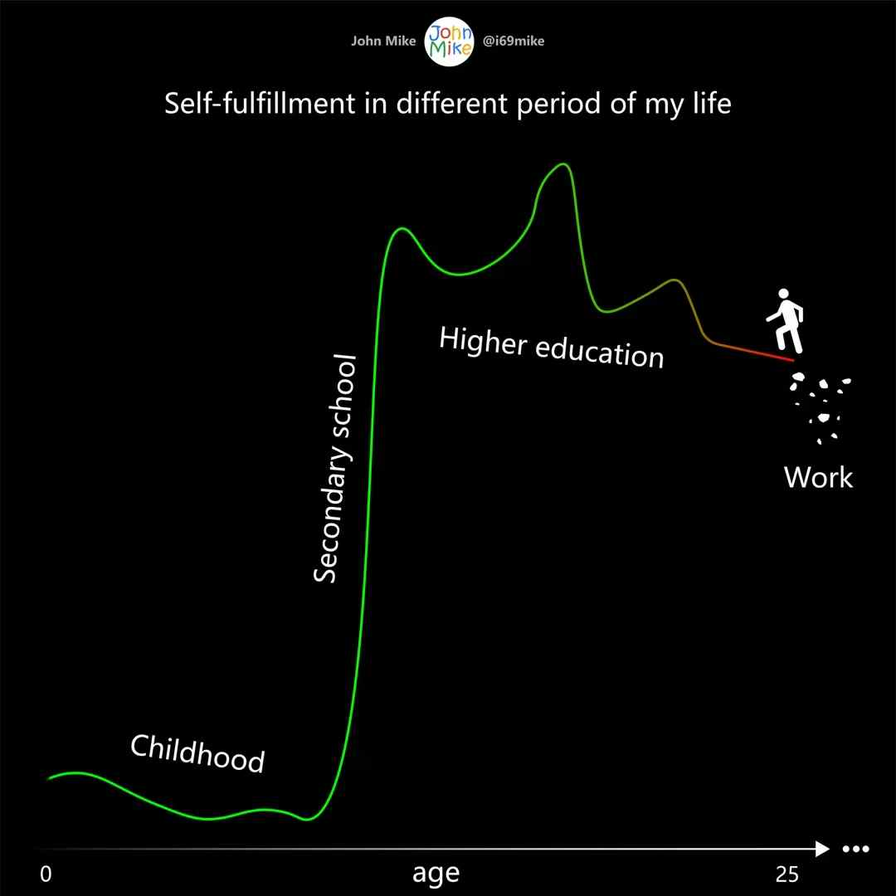
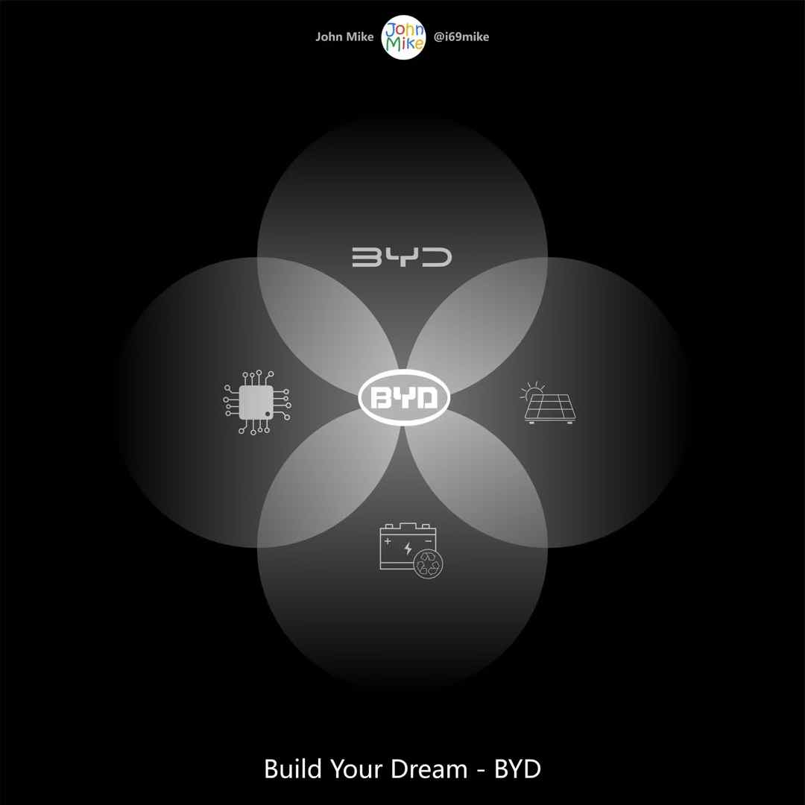
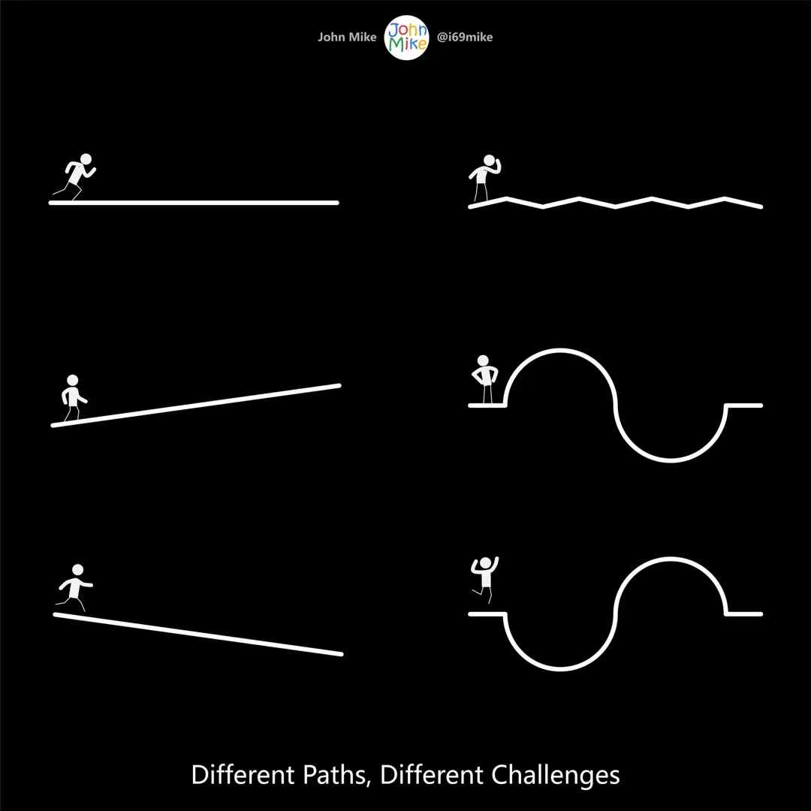
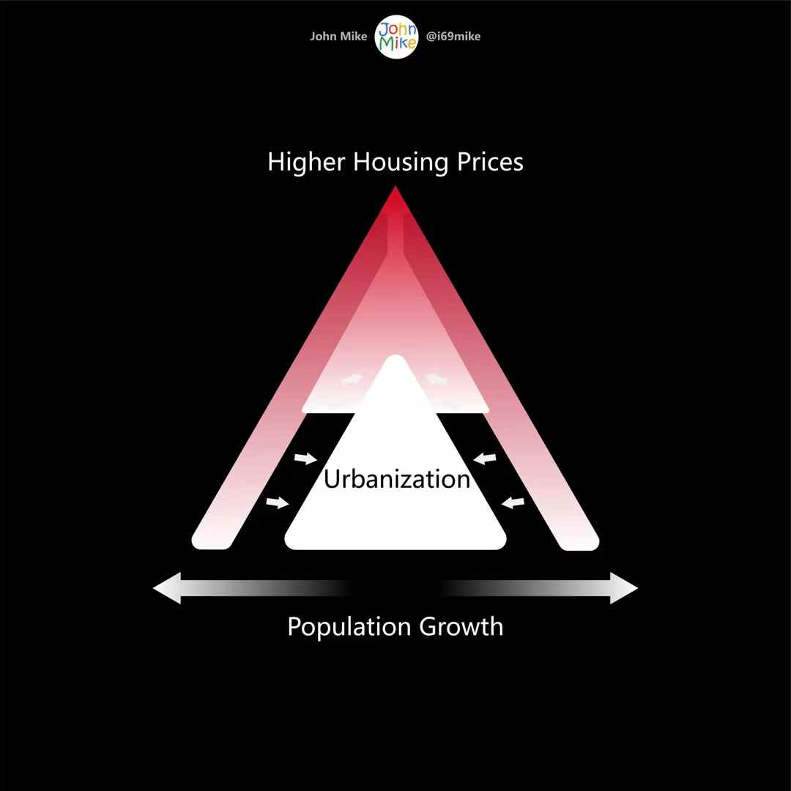
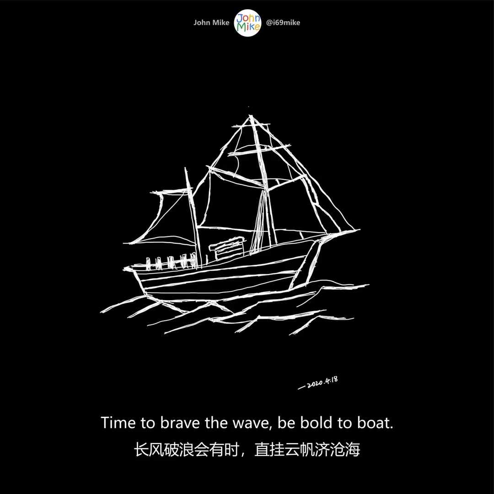
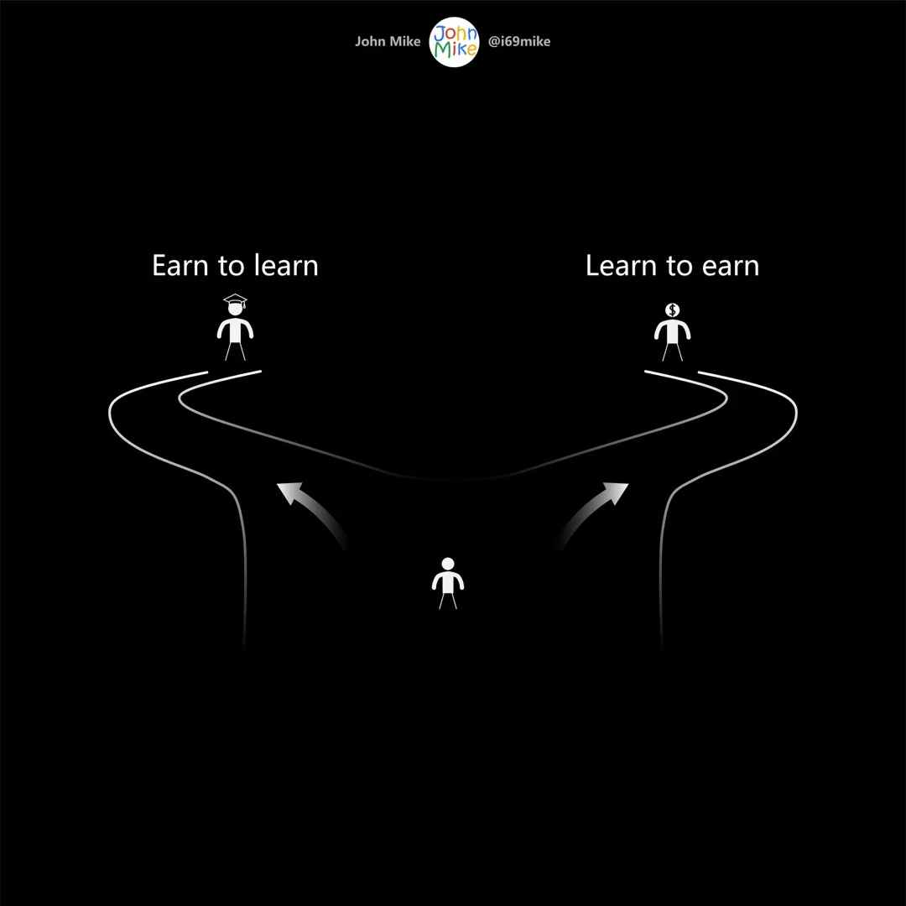
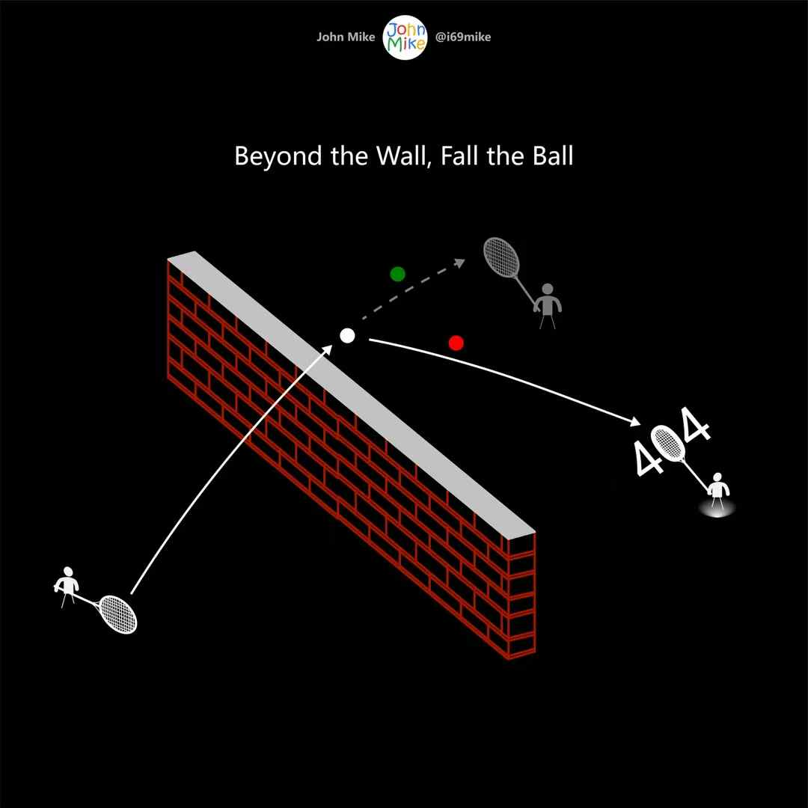
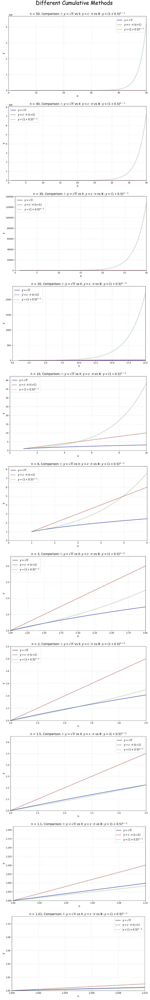
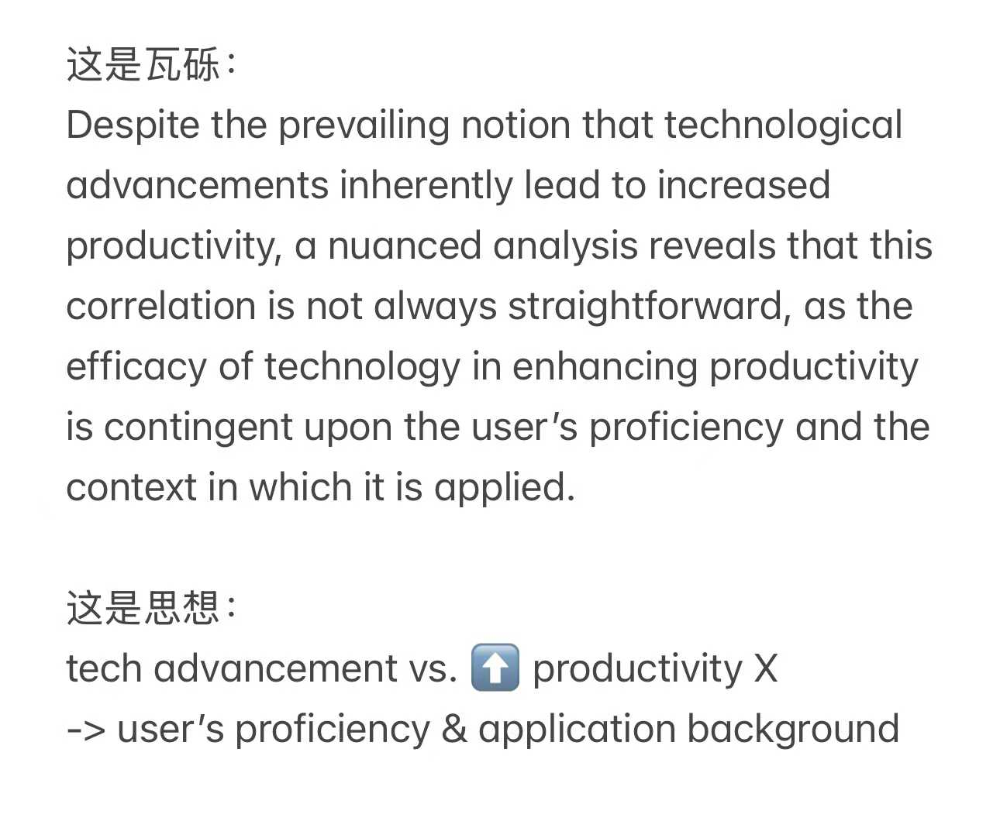

# 2025全年所作文

## Veritas

To be either earning or learning.

-2025.01.01

## 读《工程师之魂》有感

2025年读完的第一本书，是关于BYD（比亚迪）的《工程师之魂》（2024年11月第1版）。

BYD于1995年成立，以电池研发和制造为主要业务，七年后在国内香港成功上市，通过与摩托罗拉、诺基亚等知名企业合作进入到快消电子行业；

1996年，BYD作为广东省电池制造商代表，通过研究助力电动汽车的动力电池，与电动汽车结缘。2002年开始开发车用锂电池。为了给电池业务博取更广阔的市场发展空间，BYD于2003年收购了西安秦川汽车，标志着向新能源汽车领域进军，同年也开展了燃油车的出口。由于当时市场消费者对纯电动汽车的接受度较低，新能源汽车的相关补贴政策近乎于零，在这种情况下，BYD求索了”双模”路径，采取插电式混合动力系统的研发思路，而在市场慢慢成熟的过程中，逐步乃至最终完全取代燃油动力汽车；

2008年，BYD开始进入太阳能光伏发电、储能领域，开始硅和光伏组件的开发。同年，BYD收购宁波中纬（晶原厂），竖年，成功实现车载级IGBT芯片的全栈自主研制，并在后面的十年里不断迭代与版本升级；

2009年起，BYD逐渐对公共交通进行商业化的纯电动商用车生产（例如纯电动公交，纯电动大巴和纯电动出租车等）。同年，其汽车销售业务超过IT业务和电池业务之和；

在2010年—2019年期间，除了对新能源汽车电动化核心技术的持续研发投入外，BYD还尽可能地无人化操作以推进云轨、云巴等轨道交通建设与运营，触及未来城市的更多可能；

2019年是BYD见晓黎明前所经历过最黑暗的夜；

2020年，厚积薄发。BYD 始终选择“技术为王”，经过二十多年的研发坚持与技术积累，以安全性著称的磷酸铁锂刀片电池（特点是通过长方体紧密阵列排布，替代传统的圆柱体电池单元）开始”出鞘·安天下”，而王朝系列的第五个产品——汉，通过视觉创新给人以极为深刻的美感，最终迎来市场拐点，获得大卖。这一年它终见破晓；

截止到2024年底，BYD迎来它的三十而立：此时的它，依然有着强烈的主体性，摸着石头过河、一步一个脚印地迈向高质量发展，联结近百万国人员工参与这场具有时代精神的新能源盛会！

我想，它是BYD，更是比亚迪，它是Build Your Dream，更是成就您的梦想！

-2025.01.12

## 求索

生人百岁交四时，二十有五立为春。
盎然生机蓬勃起，旭日初升催步急。
不知前路寻觅处，漫漫迷鹿修远途。
山重水复疑劳苦，回首方识庐山真。

乱石投江浪反噬，竹篮打水终成空。
八面线头攒不住，流年蹉跎付匆匆。
志高存远由衷颂，千锤百炼悟凡庸。
目光如炬焦如熔，寸寸砥砺织长虹。

-2025.02.02

## Donald Trump @ Lex Fridman

美国著名采访者Lex Fridman在2025美国大选前采访到了Trump，主要针对他的政治主张、个人的生活态度进行了长约1小时的对话交流，贯穿全程，关于Trump其实没有太多新的东西，因为Trump已经当过一次总统了，许多看法大家已经有所了解，而对于像萝莉岛、中国和俄乌战争这样的敏感的话题，他也没有透露出更具体的细节，本质上还是先前认为的那样:

1. 一定要团结，让国家好起来，而不是制造分裂(例如把希拉里放入监狱);
2. 内部党派矛盾远比外部矛盾更严重，要优先解决内部问题。

在结尾部分，有一位正在人生岔路口抉择不定的读者来信(在工作还是追随内心做Research中陷入两难)，而Lex现身说法，回顾了自己的成长轨迹，从早期求学到顺利拿到PhD后的各种折腾、尝试，大约几年后在周围人的劝说下，才开始认真思考自己的人生方向，尽管浪费了大量的时间做了无关的事情(例如打跆拳道)，但所有这一切都是值得的，目前做Podcast进行人物采访已经6年了！

在这个过程中，Lex也分享了自己的人生哲学: 1. 不要畏惧未知的恐惧，无论它是什么，而在条件有限时，要利用个人力所能及的所有资源去完成它，最终借这个契机朗诵了一首Joseph Rudyard Kipling的诗(英国诺贝尔文学奖获得者)。这其实是诗人写给他12岁时的孩子的，后来也被迈克尔杰克逊作为墓志铭，它如果非要用我们自己的文化来表达，我想还是: 塞翁失马，焉知非福，塞翁得马，焉知非祸，但行好事，莫问前程。诗的全文译文如下:

如果
如果在你周围，所有人都失去冷静，
责怪你，而你还能保持头脑清醒；
如果所有人都怀疑你，
你仍然相信自己，并且容忍他人的怀疑；
如果你能等待，不会因等待失去耐性；
或者面对谎言，不会以谎言作为回应，
或者面对仇恨，不会让仇恨蒙蔽理性，
既不贪慕虚荣，也不夸夸其谈；
如果你有梦想——而不会成为梦想的奴隶；
如果你有思想——而不会把思想作为目的；
如果你能面对成功和失败
对这两个骗子一视同仁；
如果你能容忍，听到你说过的真理
被恶人歪曲，用来欺骗傻子，
或者，看到你毕生的心血碎落一地，
你却能弯下腰，用破旧的工具悉心修理；
如果你能将赢来的所有堆成一堆
冒险赌一局，玩个掷币游戏，
输掉了，却还能从头再来，东山再起
而对失去的辉煌永不再提；
如果你能打起精神，鼓起勇气
即使早已筋疲力尽，却还能坚守阵地，
坚守，即使你内心已一无所有
只剩下意志在告诫自己：“坚持下去！”
如果你能与大众攀谈并保持谦卑，
或者与国王同行却依然平易近人，
如果敌人和挚友都无法将你伤害，
如果所有人对你都很重要，但又不过于依赖；
如果你能将每一分无情的时光
都化作六十秒忙碌的奔跑，
那么，整个世界，一切的一切，都会属于你，
而且，我的孩子，你将会成为男子汉，顶天立地！

-2025.02.10

## Notes for ageless

Reading, writing, practicing, reflecting, focusing, excelling and keeping going, all time values.

-2025.03.10

## 读《巴菲特致股东的信》有感

早从《巴菲特致股东的信》中关于巴菲特就外汇的看法，就可以看出如今Trump的关税政策，尤其是不止对中国，还有对越来越多的美国盟友进行关税征收的根源了。Trump是商人，确实存在重商主义，但更重要还是他发自内心地想要让美国强大起来，从 施加关税入手，也是问题严重到他再也无法忍受这种”反向复利”而不得不面对，进而采取的激进措施。不像过往的一群政客旅鼠对于外汇问题一直那样地熟视无睹，只顾当下，Trump上台后毅然决然选择了做美国前行过程中，被挨骂的那只。2018年是如此，2025也是如此。

-2025.03.14

## Self-fulfillment in different period of my life

-2025.03.21

## BYD

-2025.03.21

## Different Paths, Different Challenges

-2025.03.21

## Urban Gravity

关于房价和人口增长的一个思考

-2025.03.22

## Be Bold

-2025.03.22

## Choose

-2025.03.23

## Wall Shadow

-2025.03.23

## It’s Time

The stock market is truly a magic place where people often pay what they’ve earned in the short term and earn what they’ve really paid for in the long term.

The costs are not directly stamped on the price tags themselves, though everything has an obvious number that helps decide whether to hold or sell.

Everyone thinks it is about timing, but few think of it as time.

-2025.04.30

## 柴静

干烈的柴在静静地燃烧，有人看的是柴静，也有人看的是燃烧。

-2025.05.06

## 创作的终点: 编辑的终点

假如工作的本质是编辑，在将一个内容创作到可以结束的状态后，迎来的不是大功告成！而是更多版本的编辑。编辑的宿敌是数不清的混乱版本，唯有以终为始的系统管理才能将编辑从版本的洪流中解脱，赋予其真正的价值。

-2025.06.10

## 科学与技术及工程与应用之区别

科学追求的是解释，解释是什么和为什么，技术追求的是如何做，需要的是创新，工程追求的是如何做得多快好省，需要的是效率，应用追求的是性价比，需要的是场景和需求。

-2025.07.22

## Not One Alone

Words I read through one after another are not the whole meaning of the book, even though the book derives its meaning from them. The days I live through, as they come and go, are not the essence of life, though time does matter and rules the Universe. What really echoes within me isn’t the individual units, but the discoveries that unfold as long as I keep going.

-2025.07.27

## Mr. Money Mustache奇遇记

几日前看了一位不知名lecturer的lecture，大抵是分享他过去十年左右实现FIRE的过程（即Financial Independence, Retire Early的首字母缩写）以及实现后的生活状态与想法，今日早间又刷到同一位lecturer在Y Combinator的访谈分享，知道了这个lecturer的网名原来叫作Mr. Money Mustache(第一次lecture未注意他叫什么)，晚间无意翻开一本书读到作者提及”钱胡子先生…”，心想这个人会不会就是传说中的Mr. Money Mustache? Yes, it is. 算一奇遇。

演讲标题: Early Retirement in One Lesson (or How I Retired at 30)
访谈标题: Don't Start a Blog, Start a Cult - Mr. Money Mustache

-2025.09.21

## √n，n和复利的人生

Hamming在You and Your Research中谈到，没有愿景的状态，就像是一个醉酒的水手随意地走动，经过n步，他走出去的距离平均不会超过√n步。但如果一个漂亮姑娘在某个方向，他就能走出与n成正比的距离。在一生的选择中，√n和n之间的差异非常大，这代表了没有愿景和有愿景之间的区别。好的愿景具备更高的上限。如果把它们与复利做一个对比会怎样？

在最开始，以非常细微的增量n进行踱步，能够抵达的距离远近的顺序是：n，其次是√n，最后才是复利。起初它带来的差异性并无任何优势可言。但随着时间的推移，才能看出复利对结果影响的重要程度。如果x=n是一个人的时间，那么图中就分别对应着√n，n和复利的人生。

-2025.10.26

## I Still Had Faith

There was a time when I believed I was moving through the channel — with fresh air, blue sky, and bright sunshine appearing just ahead, as if the outside world were finally within reach — yet all of it led only to a dead end. And I wrote to myself that, if nothing else, I still had faith.

-2025.11.26

## 瓦砾与墙

没有思想的文字，就像是无边的疆土，而没有文字的思想，就像疆土的无边。

一种思想，它所对应表达最为贴切的文字集合中每一个词，都仿如一个个不起眼的瓦砾。它们通过前后协调，以有序堆叠的方式进行呈现，在无边的疆土上最终筑起了一道厚厚的围墙。这些围墙的作用，自然是抵御着外部思想的侵犯：唯有高高的墙才能将一种思想从全部思想中抽离出来，从无边的疆土中划出有形的空间。所用瓦砾构造围墙的高度也代表了这样一种思想与其余所有思想的一个区别程度。从这个意义上来说，瓦砾所能达到的最高高度，自然也是这一种思想所蕴含的最深深度的一个近似抵达。

简而言之，没有瓦砾的思想，如同没有围墙的疆土，让人不明方向与高深，而没有思想的瓦砾，则是一盘散沙，随风而流，只可作丘。

-2025.11.28

## Dots and Line

In moving forward, distance; in looking back, clarity.

-2025.11.29

## 复利

Trump OBBBA中的Trump account，是一个以跟踪S&P500或同类大盘ETF指数的基金，通过政府出钱解决初始资金(1000刀)，依靠复利的方式来实现对下一代新生小孩的个人储蓄积累，这笔钱一直持续到18岁才可以取出。

按照5%左右的年复利来计算，每15年可以翻一番。在18岁的那一年，会有2500刀复利储蓄。按照SPY500年均复合回报来看，以10%计，18岁以后也不取出，这笔钱仍持续复利，这个小孩在他(她)的35岁和60岁分别会有3万刀和35万刀的复利储蓄，这仅仅是从Trump account 中政府提供的1000刀作为初始资金来考虑，而这个账户还可以在接受来自私人、企业(如最近的Dell 夫妇)的捐赠。这个account 目前只认可2025年初到2028年底期间出生的小孩。

如果说关税是Trump针对其他国家对美国长期贸易逆差所带来的“反向复利”而采取的应对措施，那么Trump account正好反过来，是对自己国民长期无储蓄习惯而通过法案强制实现”正向复利”的一个尝试。

Trump关于抬高关税和设立Trump account 的做法，让我想到两个人，一个是Buffet，他之前谈到关税问题时有过一些想法，Trump如今活生生成为了Buffet该想法的最有力践行者，另一个则是Franklin，他在1790年设立遗嘱时，要求在Boston和Philadelphia 两座城市分别以1000英镑作为启动资金，进行不断复利，连续200年，前100年只可以取出一小部分用于扶植年轻人，后100年可以取一部分用于公共建设，200年后可全部用作城市建设。在Trump account 方面，Trump无疑是Franklin关于复利这一抽象概念具像化演示的又一追随者。前者是两任美国总统，后者是美国国父。

复利，被Einstein 称为是世界的第八大奇迹。如果世界整体上是良性发展的，所有人或多或少最终都会因此而受益。如果整体是恶性的呢？即便它是一开始是微不足道的，但只要还在持续发展中，那所有人成员也都会受到牵连，这样的复利，或许回过头来才发现这原来就是不可承受之”轻”。

-2025.12.06

## You Get What You Measure (一)

如果有一把尺，上面没有刻度，但只有三个区间(两头和中间位置)，用这个尺去表征一群人得到的结果，与这群人做IQ测试得到的结果大概率会是一样的，这个比例遵循正态分布: 大多数人会落在这把尺子的中间，少数人会落在这把尺子的两头，形状像是钟形。

如果是基于这个统计规律去设计IQ测试标准，使得其更加能够反映一个人的智力，通过不断地测试小样本数据，最后得到最好的结果也就是正态分布规律。

这里存在两个容易忽略的方面:

1. 我们只能得到我们所测量的结果，这更取决于我们测量的方式是否合适，而不是一味地追求测量结果的精确性。合适的方法，得到的测量结果，哪怕只是一个大概，也远比不恰当的方法测得如何准确更重要；

2.基于数据统计得到的概率，对所有人而言，是不可否认的铁律，但对一个个体而言，只要他能够正确认识到这种测量方法的局限性，或许他可以很轻易地破除这个未来的”陷阱”或停留在过去的”迷信”。

-2025.12.11

## Jensen Huang

单看Nvidia的持股，Jensen Huang目前已超过一万亿人民币(约1500亿美元)。他出生台湾，随父亲工作到泰国念书，直到街上出现了一些坦克和士兵，才开始到美国上中学(去的是美国最穷的一个地方，最乱的学校)。到了那里，9岁学抽烟，在学校里，被分到刷厕所，后面慢慢走上正轨，两年后父母来美国。期间打不起国际电话，就通过录音机磁带录音，录完后邮寄给父母，父母收到录音带后听完再重新录音，把想说的话录完后寄回给Jensen，这种状态持续了两年(直到父母来)。

Jensen说自己有suffering genes，或许正是他的过去的suffering built the kind of genes.

-2025.12.17

## The Choice

Sounds unheard become noise; words untold, silence.
Warmth not delivered cools to coldness; an ego unexamined, arrogance.
Time unused breeds penitence; a life not lived, death.

How do we hold the moment of choosing—to be or not to be—by justice, or just by prejudice? After all, we all have the choice.

-2025.12.19

## 开源精神

时间过去没有多久，可以下载大量文献的SCI-hub被ban（可参考三年前我写的一篇文章），有着世界图书馆之称的Z-Library 也持续被ban（影响力最大的一个域名已被FBI ban了，并随意挂了几张欲将引罪于俄国人的炫富图片），但近几年情况已有所不同，一个真正普及到每一个人，带来完全开放知识获取的便利性的，且无法再被任何政府，出版商想法设法ban掉的一个趋势性工具，诞生了：大语言模型！

大语言模型的出身也绕不开版权保护的问题，但利大于弊。在生米煮成熟饭后（GPT3.5），同一时间，几乎所有人都在陶醉、惊叹，遐想这一新质生产力将要引起方方面面的变革，却很少有关于AI知识产权的严肃性话题，显然，大部分被训练的数据都是公开的，来自互联网，其中许多是涉及版权保护的，尤其是在商业化使用时。

一个强大的大语言模型的出现，让越来越多人逐渐想起了，人类的绝大部分知识都应该能够被公开获取，被随时随地访问的重要性，否则它不会诞生，即便诞生了也无法变得更具人类视野。

过去那些秉持这一理念的人们，其实自始至终在传递一种开源精神，哪怕近半个世纪过去了，这种精神依旧是万维网（www）的核心，并变得越来越重要。

-2025.12.25

## Educated

A university degree wouldn’t guarantee a job, but continuing education is cultivating the individual with trial and errors, breeding experience, reflection, expertise, insight, resilience, perseverance, flexibility, hence, a brand new path who normally doesn’t choose to pursue.

-2025.12.30

| [< Previous year: 2024](./2024.md) | [ Next year: 2026](./2026.md) |
|------------------------------------|-------------------------------|
